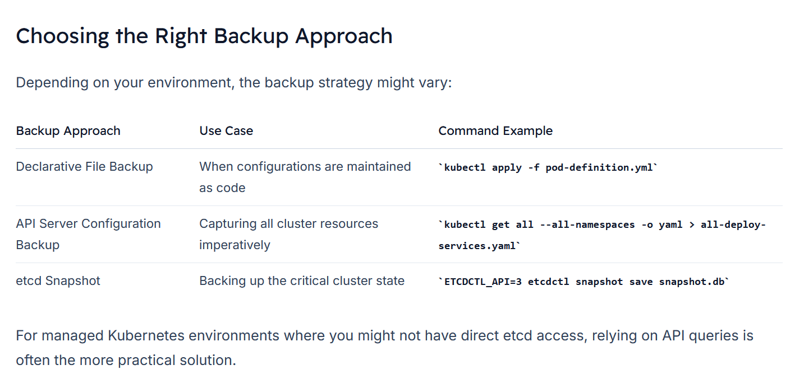

# Backing Up the etcd Cluster
The ```etcd cluster``` is the backbone of your Kubernetes system, **storing critical state and configuration details.** 

-   Typically located on the ```master nodes```, ```etcd```’s data resides in a dedicated directory determined during setup.

-   Below is an example of how ```etcd``` might be configured on a ```master node```:
    ```bash
    ExecStart=/usr/local/bin/etcd \\
    --name ${ETCD_NAME} \\
    --cert-file=/etc/etcd/kubernetes.pem \\
    --key-file=/etc/etcd/kubernetes-key.pem \\
    --peer-cert-file=/etc/etcd/kubernetes.pem \\
    --peer-key-file=/etc/etcd/kubernetes-key.pem \\
    --trusted-ca-file=/etc/etcd/ca.pem \\
    --peer-trusted-ca-file=/etc/etcd/ca.pem \\
    --client-cert-auth \\
    --initial-advertise-peer-urls https://${INTERNAL_IP}:2380 \\
    --listen-peer-urls https://${INTERNAL_IP}:2380 \\
    --advertise-client-urls https://${INTERNAL_IP}:2379 \\
    --initial-cluster etcd-cluster-0 \\
    --initial-cluster-token etcd-cluster-0 \\
    --initial-cluster controller-0=https://${CONTROLLER0_IP}:2379 \\
    --initial-cluster-state new \\
    --data-dir=/var/lib/etcd
    ```

```etcdctl``` is a command line client for ```etcd```.

-   etcd offers a built-in snapshot feature via the ```etcdctl``` command. To create a snapshot called ```"snapshot.db"```, run:
    ```bash
    ETCDCTL_API=3 etcdctl snapshot save snapshot.db
    ```

-   After creating the snapshot, you can verify its existence:
    ```bash
    ls
    ```

-   And check the snapshot status:
    ```bash
    ETCDCTL_API=3 etcdctl snapshot status snapshot.db
    ```

In all our Kubernetes Hands-on labs, the ETCD key-value database is deployed as a static pod on the master. The version used is v3.


To make use of etcdctl for tasks such as **back up and restore,** make sure that you set the **ETCDCTL_API to 3.**

### On the Master Node:
```bash
export ETCDCTL_API=3
etcdctl version
```

#### Take snapshot [Advanced Command] For an authenticated backup, use:

```bash
ETCDCTL_API=3 etcdctl --endpoints=https://[127.0.0.1]:2379 \
--cacert=/etc/kubernetes/pki/etcd/ca.crt \
--cert=/etc/kubernetes/pki/etcd/server.crt \
--key=/etc/kubernetes/pki/etcd/server.key \
snapshot save /opt/snapshot-pre-boot.db
```

## Restoring from an etcd Backup
In the event of a failure, restoring your cluster from an etcd backup involves several steps:

1.  **Stop the ```Kubernetes API Server:```** The restore process requires stopping the API server.

2.  **Restore the Snapshot:** Restore the snapshot to a new data directory (e.g., /var/lib/etcd-from-backup):
Restore the snapshot
    ```bash
    ETCDCTL_API=3 etcdctl  --data-dir /var/lib/etcd-from-backup \
    snapshot restore /opt/snapshot-pre-boot.db
    ```
    -   This command initializes a new etcd data directory and reinitializes cluster members.

3.  **Update etcd Configuration:** Modify your etcd configuration file to point to the new data directory.

4.  **Restart Services:** Reload the system daemon, restart the etcd service, and finally restart the Kubernetes API server.


### Remember

Always supply the required certificate files (CA certificate, etcd server certificate, and key) during backup and restore operations to ensure secure communications.


