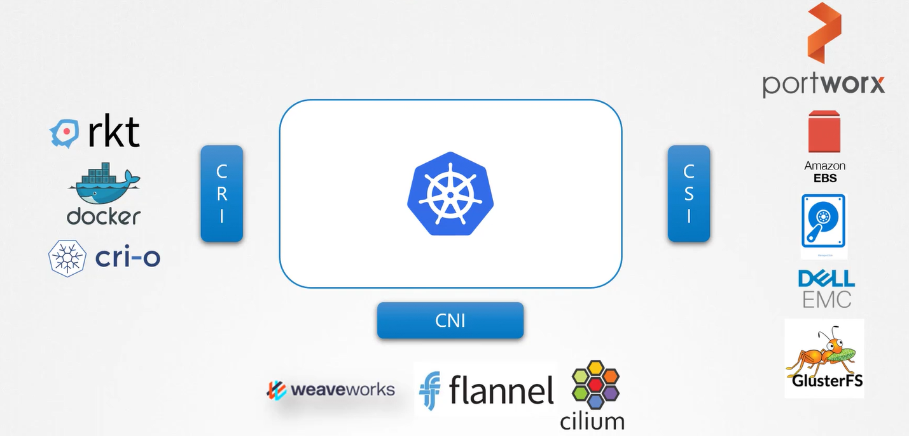
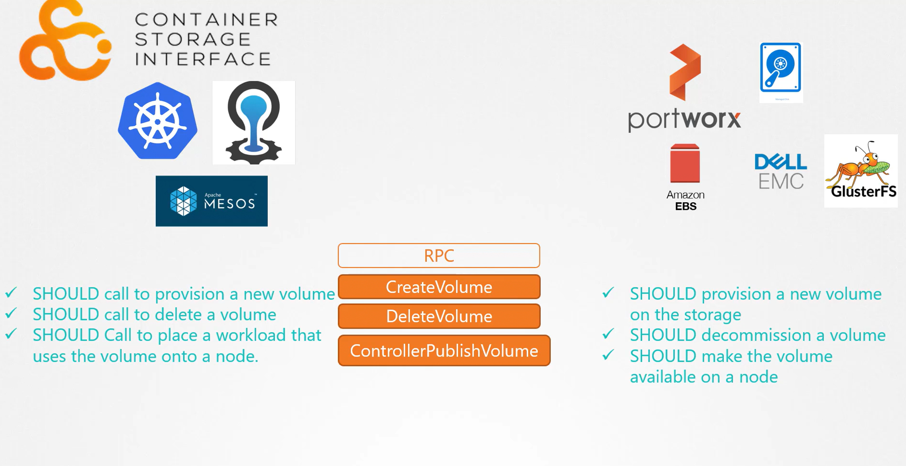

# Container Storage Interface (CSI)
-   CSI provides a standardized way to integrate various storage solutions with container orchestrators, eliminating the need for bespoke, embedded storage code within the core of these systems.

## Evolution in Container Orchestration

-   Historically, **Kubernetes** relied exclusively on **Docker** as the *container runtime engine.* 
    -   All code for interfacing with Docker resided within the Kubernetes source. 
    -   However, with the *emergence* of **alternative container runtimes—such** as *Rocket* and *CRI-O*—it became necessary to support multiple runtimes without altering Kubernetes' core codebase.

-   This challenge led to the *development* of the **Container Runtime Interface (CRI)**, a standard that enables orchestration tools like **Kubernetes** to *communicate with different container runtimes seamlessly.*

-   In a similar manner, **the Container Networking Interface (CNI)** was introduced to *facilitate the integration of diverse networking solutions*. 
    -   CNI allows *networking vendors* to **build plugins** that adhere to *standardized specifications, ensuring smooth operation within Kubernetes environments.*

- **CSI** extends these s*tandardization principles* to the *storage domain*, enabling support for *multiple storage systems without modifications to container orchestration platforms*.

## The Role of CSI

-   The Container Storage Interface (CSI) **empowers** **developers** to *create custom drivers for various storage systems*. 

-   Popular examples include:

    1.  Portworx
    2.  Amazon EBS
    3.  Azure Disk
    4.  Dell EMC
    5.  Isilon
    6.  PowerMax
    7.  Unity
    8.  Extreme IO
    9.  NetApp
    10. Nutanix
    11. HPE
    12. Hitachi
    13. Pure Storage

-   **CSI is not exclusive to Kubernetes.** 

-   In fact, **any container orchestration** tool that **implements the CSI standard** can work with *virtually any storage vendor supporting a CSI plugin.* 

-   Currently, **leading platforms** such as **Kubernetes, Cloud Foundry, and Mesos** have adopted **CSI**.

## How CSI Works
-   When a **pod** is created that **requires persistent storage**, the container orchestrator (e.g., Kubernetes) calls the **"create volume" Remote Procedure Call (RPC)** defined by the CSI standard.
    -   This **call includes** vital details such as the **volume name** and other **parameters**. 

    -   The **storage driver** then processes the request by **provisioning a new volume** on the associated storage array and returns the result to the orchestrator.

-   Similarly, **when a volume is no longer needed,** the orchestrator issues a **"delete volume" RPC.** 
    -   The storage driver responds by removing the specified volume from the storage system.

## CSI Architecture Diagram
