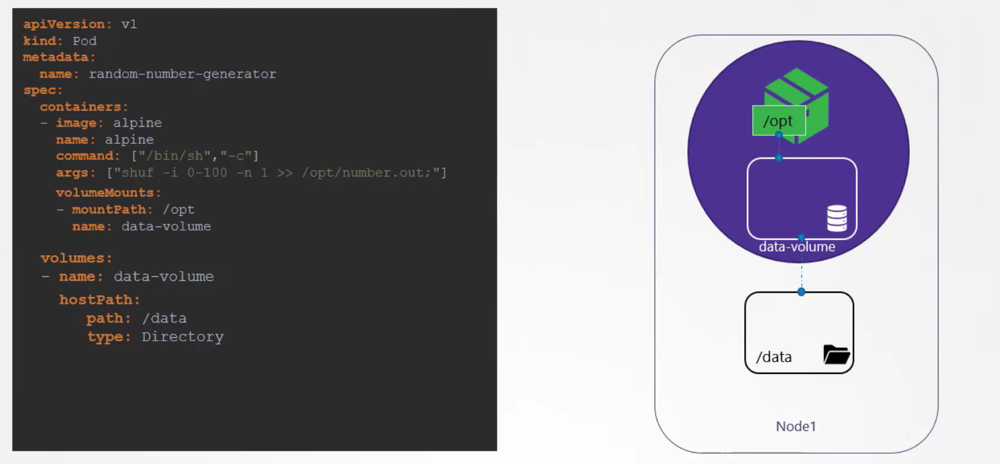
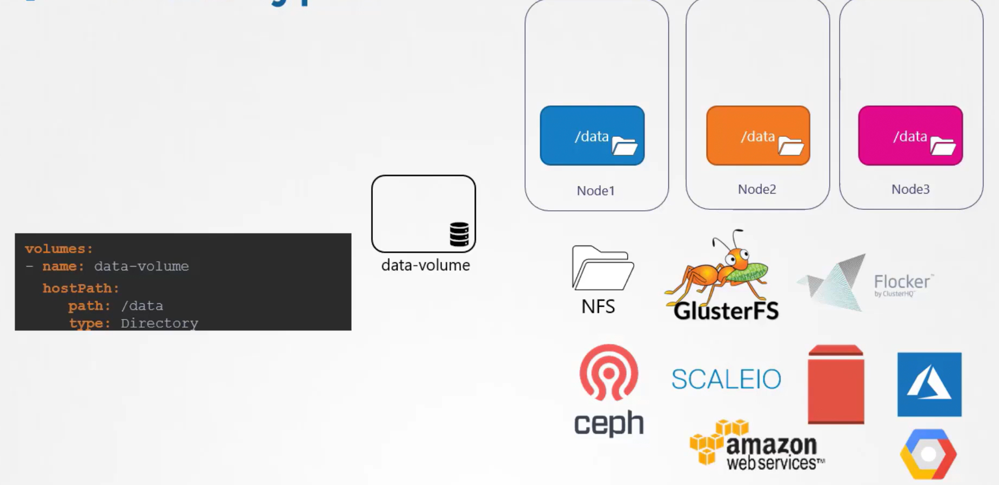

# Volumes

## Overview of Volumes in Docker
-   Docker containers are designed to be **transient**: they are *created as needed, process data, and are then destroyed*.

    -   As a consequence, **any data stored within a container is lost when the container is removed.** 

-   **To overcome this limitation**, Docker allows you to **attach a volume to a container** so that the **data persists** *even after the container's lifecycle ends.*

## Volumes in Kubernetes 
-    Similarly, when a **pod** processes data and is **subsequently deleted**, **the data inside it is normally lost.**


### A Simple Example of Using Volumes


-   **Without a volume**, this *file would be lost when the pod is deleted.* 
    -   **By attaching a volume** that *uses a directory on the host for storage, the generated number is preserved.*

-   In this example, the volume is configured to use the host's ```/data``` directory.
    -   The volume is then mounted to the ```/opt``` directory inside the container.

```bash
apiVersion: v1
kind: Pod
metadata:
  name: random-number-generator
spec:
  containers:
  - image: alpine
    name: alpine
    command: ["/bin/sh", "-c"]
    args: ["shuf -i 0-100 -n 1 >> /opt/number.out;"]
    volumeMounts:
    - mountPath: /opt
      name: data-volume
  volumes:
  - name: data-volume
    hostPath:
      path: /data
      type: Directory
```

## Volume Storage Options
-   In the above example, we utilized a hostPath volume, **which is suitable for a single-node cluster.** 

-   For **multi-node clusters** where each node's ```/data``` directory may differ, Kubernetes *supports* several external and replicated storage solutions. 
-   Some popular storage options include:
        
        1.  NFS
        2.  GlusterFS
        3.  Flocker
        4.  Fibre Channel
        5.  CephFS
        6.  ScaleIO
        7.  Public cloud storage solutions like AWS EBS, Azure Disk or File, and Google Persistent Disk



