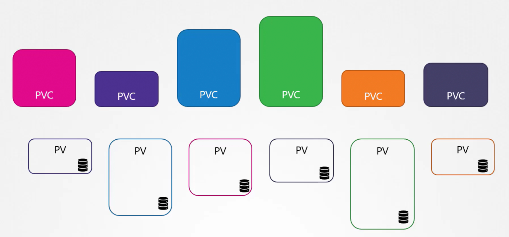
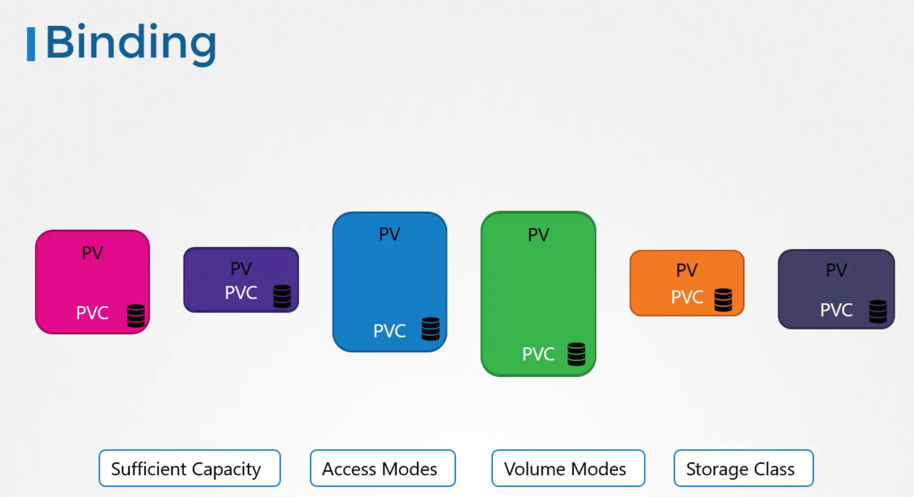
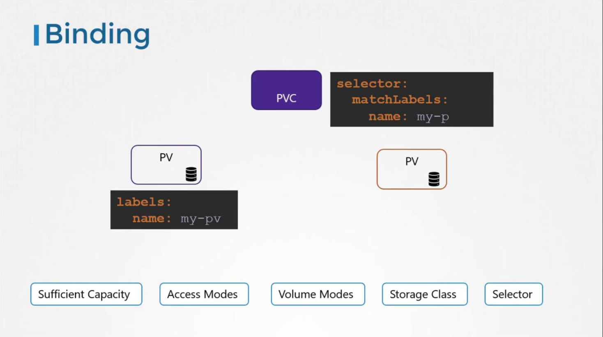
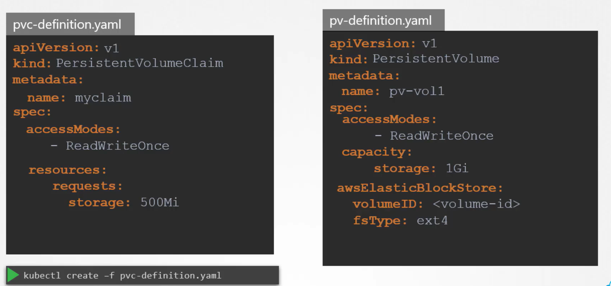
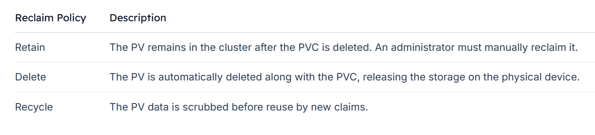

# Persistent Volume Claim

-   We will explore how to **create a Persistent Volume Claim**(PVC) to **expose that storage to a node**.

-   **Persistent volumes** and **persistent volume claims** are **two distinct objects** in Kubernetes.

-   An **administrator** is *responsible* for **creating PVs**, while **users** create **PVCs** to *request storage resources.*

-   When a ```PVC``` is created, Kubernetes automatically **binds it to a PV** that meets the requested **capacity, access modes, volume modes, and storage class**.





-   Kubernetes evaluates several factors when binding a ```PVC``` to a ```PV```. 

    -   **If multiple PVs can satisfy** a claim, you can use **labels** and **selectors** to bind the claim to a specific volume.





## Important
-   If a **smaller PVC** is matched with a **larger PV** that meets all criteria, the **unrequested capacity remains unused by any other PVC.**
- If no **PV** satisfies the claim’s requirements, the **PVC** will remain in a **pending state** until a new, suitable PV becomes available.


## Creating a Persistent Volume Claim
- In this configuration, we set the ```API version``` to **v1** with ```kind``` **PersistentVolumeClaim**, and ```name``` it "**myclaim**". Under the ```specification``` section, the ```access mode``` is set to **ReadWriteOnce**, and 500 MiB of storage is requested.

- To create the PVC:
  
  1.  Save the above YAML to a file, for example, ```pvc-definition.yaml```.
  
      ```bash
      #pvc-definition.yaml
      apiVersion: v1
      kind: PersistentVolumeClaim
      metadata:
        name: myclaim
      spec:
        accessModes:
          - ReadWriteOnce
        resources:
          requests:
            storage: 500Mi
      ```

  2.  Run the command below in your terminal:
      ```bash
      kubectl create -f pvc-definition.yaml
      ```
  
- You can verify the created PVC by executing:
  ```bash
  kubectl get persistentvolumeclaim
  
  kubectl get pvc
  ```


## Deleting a PVC 
- To delete a PVC, use the following command:
  ```bash
  kubectl delete persistentvolumeclaim myclaim
  
  kubectl delete pvc myclaim
  ```

## Persistent Volume Reclaim Policies

-   When a ```PVC``` is deleted, what happens next depends on the underlying **persistent volume's reclaim policy**. 



### Note

The "Recycle" ```reclaim policy``` is deprecated in recent Kubernetes versions and might not be available in your cluster.

- For example, to set the reclaim policy to Retain, you would include
  ```bash
  persistentVolumeReclaimPolicy: Retain
  ```

  ```bash
  apiVersion: v1
  kind: PersistentVolume
  metadata:
    name: pv-log
  spec:
    persistentVolumeReclaimPolicy: Retain         # <======
    accessModes:
      - ReadWriteMany
    capacity:
      storage: 100Mi
    hostPath:
      path: /pv/log
  ```

## Updating the Pod to Use the PVC
- Edit the pod manifest to remove the ```HostPath``` volume and replace it with the PVC reference.
  ```bash
  apiVersion: v1
  kind: Pod
  metadata:
  name: mypod
  spec:
  containers:
    - name: myfrontend
      image: nginx
      volumeMounts:
        - mountPath: "/var/www/html"
          name: mypd
  volumes:
      - name: mypd
        persistentVolumeClaim:
          claimName: myclaim
  ```

- The same is true for ```ReplicaSets``` or ```Deployments```. 
  -   Add this to the pod template section of a ```Deployment``` on ```ReplicaSet```.