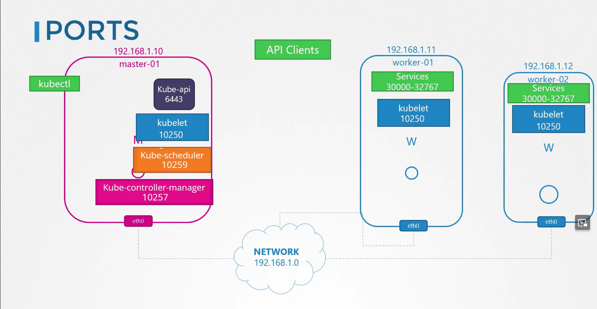
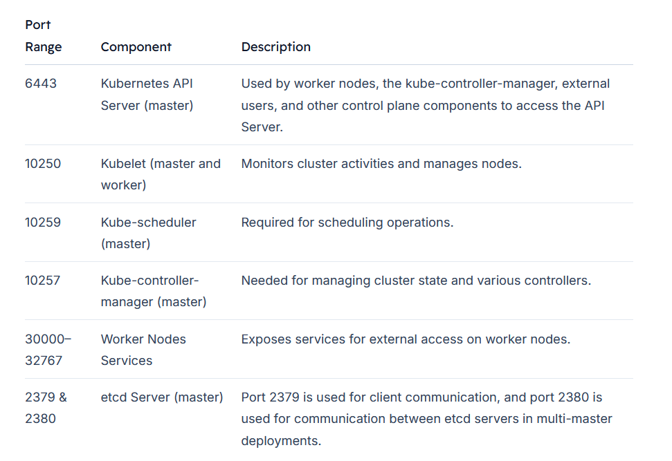

# Cluster Networking
-   We explore the networking configurations necessary for both the master and worker nodes within a Kubernetes cluster.

-   Each node must be equipped with at **least one network interface** configured with an IP address. 
-   Additionally, every host should have a unique hostname and MAC address—this is especially important when creating virtual machines (VMs) by cloning existing ones.

## Required Ports for Kubernetes Components

