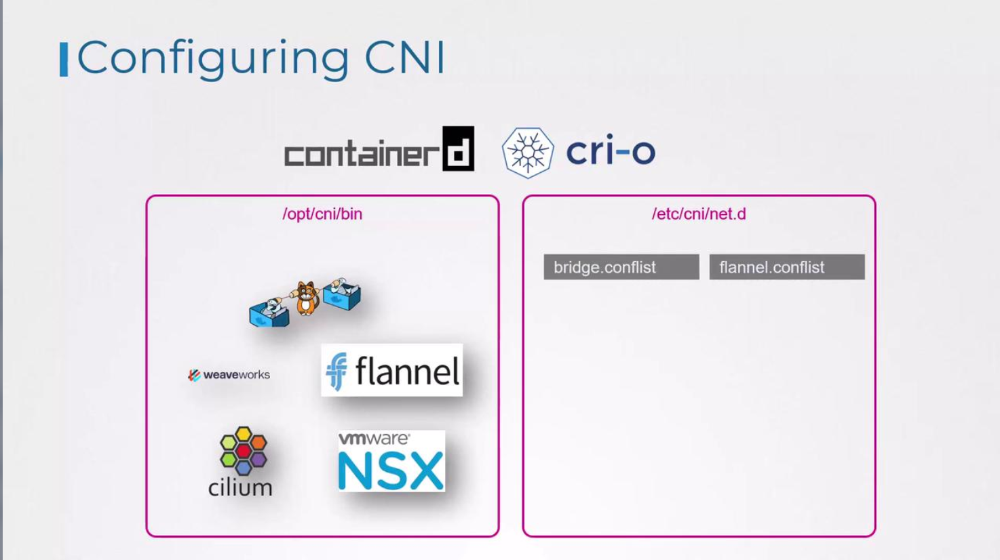

# CNI in kubernetes

-   CNI specifies the responsibilities of the container runtime.
-   In Kubernetes, container runtimes such as Containerd or CRI-O 
    -   create the container network namespaces and 
    -   attach them to the correct network by invoking the appropriate network plugin.
        -   Although Docker was initially the primary container runtime, it has largely been replaced by Containerd as an abstraction layer.

## Configuring CNI Plugins in Kubernetes
-   When a container is created, the container runtime invokes the necessary CNI plugin to attach the container to the network.


## Directory Structure for CNI Plugins and Configuration
-   The network plugins reside in ```/opt/cni/bin```, and the configuration files that dictate which plugin to use are stored in ```/etc/cni/net.d```.

For example, you might see the following directories:
```bash
ls /opt/cni/bin

bridge  dhcp  flannel  host-local  ipvlan  loopback  macvlan  portmap  ptp  sample  tuning  vlan  weave-ipam  weave-net  weave-plugin-2.2.1
```

```bash
ls /etc/cni/net.d

10-bridge.conflist
```

In this case, the container runtime chooses the "bridge" configuration file.



### Understanding a CNI Bridge Configuration File
A typical CNI bridge configuration file, adhering to the CNI standard, might look like this:
```bash
cat /etc/cni/net.d/10-bridge.conf
```

```bash
{
  "cniVersion": "0.2.0",
  "name": "mynet",
  "type": "bridge",
  "bridge": "cni0",
  "isGateway": true,
  "ipMasq": true,
  "ipam": {
    "type": "host-local",
    "subnet": "10.22.0.0/16",
    "routes": [
      { "dst": "0.0.0.0/0" }
    ]
  }
}
```


In this configuration:

-   The ```"name"``` field (e.g., "mynet") represents the network name.
-   The ```"type"``` field set to "bridge" indicates the use of a bridge plugin.
-   The ```"bridge"``` field (e.g., "cni0") specifies the network bridge's name.
-   The ```"isGateway"``` flag designates whether the bridge interface should have an IP address to function as a gateway.
-   The ```"ipMasq"``` option enables network address translation (NAT) through IP masquerading.
-   The ```"ipam"``` (IP Address Management) section uses "host-local" to allocate IP addresses from the specified subnet ("10.22.0.0/16") and defines a default route.