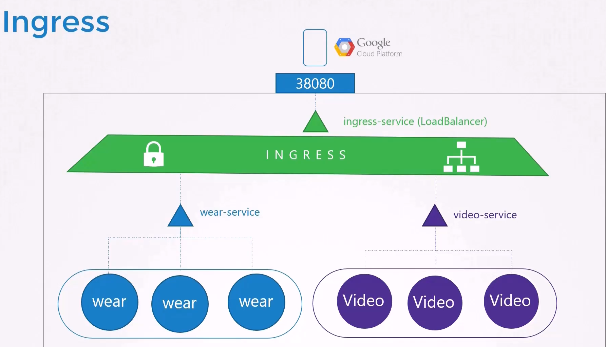

# Ingress

We will explore the **differences between Services and Ingress**, explain when to use each, and demonstrate how to deploy and configure Ingress resources effectively.

We begin by revisiting Services and then build toward understanding Ingress.

## Background: Using Services for External Access

-   Imagine you are deploying an application for a company with an online store at *myonlinestore.com.* 

    -   You build your application as a **Docker image** and **deploy it on a Kubernetes cluster as a pod within a Deployment**. 
    -   The application requires a **database**, so you deploy a **MySQL pod** and *expose it with a ClusterIP Service named MySQL service.
    
    -   Internally, your application functions properly.

-   To **expose the application externally,** you create a *Service of type NodePort,* mapping the application to a high port (e.g., 38080) on your cluster nodes.

    -   In this configuration, users access your application using a URL like:
        -   ```http://<node_IP>:38080```

    -   As traffic increases, the Service load-balances the requests among multiple application pods. 

-   In a production environment, however, you likely want users to access your application through a **user-friendly domain name instead of a node IP address with a high port number.**

    -   To achieve this, you would up**date your DNS configuration** to point to your **node IPs** and **deploy a proxy server** *that forwards requests from standard port 80 (or 443 for HTTPS) on your DNS to the NodePort defined in your cluster.*

    -   With this approach, users can simply navigate to myonlinestore.com.

### Cloud-Native Approach with LoadBalancer

-   If your application is hosted on a public cloud platform like **Google Cloud Platform (GCP)**, the process can be simplified further. 

    -   **Instead of creating a NodePort Service, you can deploy a Service of type LoadBalancer.** 
    
    -   In this setup:
        -   Kubernetes assigns an internal high port.
        -   It sends a request to GCP to deploy a network load balancer.
        -   The cloud load balancer routes traffic to the internal port across all nodes.
        -   An external IP is provided by the load balancer, which you point your DNS to.

    -   This allows users to access your application directly using myonlinestore.com.

## The Need for Ingress

### Problem:
-   Imagine your company expands and you launch new services. 

    -   For example, you might offer:

        -   A video streaming service on ```myonlinestore.com/watch```
        -   The original application on ```myonlinestore.com/wear```

    -   Even if both applications run within the same cluster with separate Deployments and Services (e.g., a LoadBalancer Service for the video service), **each service might get its own high port and cloud load balancer.**

    -   **Managing multiple load balancers can increase costs, add complexity, and complicate SSL/TLS (HTTPS) configurations.**


### Introducing Ingress

-   Ingress *simplifies external access* by providing a **single externally accessible IP for your Kubernetes applications.** 

    -   It **allows you to configure URL-based routing rules, SSL termination, authentication, and more—acting as a built-in layer 7 load balancer.**

-   Even with Ingress, you still need an **initial exposure mechanism (via NodePort or a cloud-native LoadBalancer).**

However, once this is set up, all further changes are made through the Ingress controller.


**Without Ingress**, you would have to **manually deploy and configure a reverse proxy or load balancer** (such as NGINX, HAProxy, or Traefik) **within your cluster to handle URL routing and manage SSL certificates.** 

Ingress builds on these principles to offer an integrated solution.




## Deploying an Ingress Controller

-   To use Ingress, you must **first deploy an Ingress controller.**

-   **The controller continuously monitors the cluster for changes** *in Ingress resources and reconfigures the underlying load balancing solution accordingly.*


### Note:

A Kubernetes cluster does not include an Ingress controller by default. If you create Ingress resources without deploying an Ingress controller, they will have no effect.