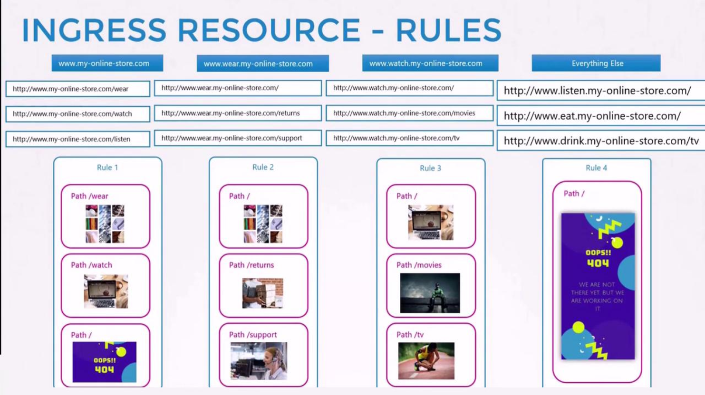

# Ingress

We will explore the **differences between Services and Ingress**, explain when to use each, and demonstrate how to deploy and configure Ingress resources effectively.

We begin by revisiting Services and then build toward understanding Ingress.

## Background: Using Services for External Access

-   Imagine you are deploying an application for a company with an online store at *myonlinestore.com.* 

    -   You build your application as a **Docker image** and **deploy it on a Kubernetes cluster as a pod within a Deployment**. 
    -   The application requires a **database**, so you deploy a **MySQL pod** and *expose it with a ClusterIP Service named MySQL service.
    
    -   Internally, your application functions properly.

-   To **expose the application externally,** you create a *Service of type NodePort,* mapping the application to a high port (e.g., 38080) on your cluster nodes.

    -   In this configuration, users access your application using a URL like:
        -   ```http://<node_IP>:38080```

    -   As traffic increases, the Service load-balances the requests among multiple application pods. 

-   In a production environment, however, you likely want users to access your application through a **user-friendly domain name instead of a node IP address with a high port number.**

    -   To achieve this, you would up**date your DNS configuration** to point to your **node IPs** and **deploy a proxy server** *that forwards requests from standard port 80 (or 443 for HTTPS) on your DNS to the NodePort defined in your cluster.*

    -   With this approach, users can simply navigate to myonlinestore.com.

### Cloud-Native Approach with LoadBalancer

-   If your application is hosted on a public cloud platform like **Google Cloud Platform (GCP)**, the process can be simplified further. 

    -   **Instead of creating a NodePort Service, you can deploy a Service of type LoadBalancer.** 
    
    -   In this setup:
        -   Kubernetes assigns an internal high port.
        -   It sends a request to GCP to deploy a network load balancer.
        -   The cloud load balancer routes traffic to the internal port across all nodes.
        -   An external IP is provided by the load balancer, which you point your DNS to.

    -   This allows users to access your application directly using myonlinestore.com.

## The Need for Ingress

### Problem:
-   Imagine your company expands and you launch new services. 

    -   For example, you might offer:

        -   A video streaming service on ```myonlinestore.com/watch```
        -   The original application on ```myonlinestore.com/wear```

    -   Even if both applications run within the same cluster with separate Deployments and Services (e.g., a LoadBalancer Service for the video service), **each service might get its own high port and cloud load balancer.**

    -   **Managing multiple load balancers can increase costs, add complexity, and complicate SSL/TLS (HTTPS) configurations.**


### Introducing Ingress

-   Ingress *simplifies external access* by providing a **single externally accessible IP for your Kubernetes applications.** 

    -   It **allows you to configure URL-based routing rules, SSL termination, authentication, and more—acting as a built-in layer 7 load balancer.**

-   Even with Ingress, you still need an **initial exposure mechanism (via NodePort or a cloud-native LoadBalancer).**

However, once this is set up, all further changes are made through the Ingress controller.


**Without Ingress**, you would have to **manually deploy and configure a reverse proxy or load balancer** (such as NGINX, HAProxy, or Traefik) **within your cluster to handle URL routing and manage SSL certificates.** 

Ingress builds on these principles to offer an integrated solution.


## A. Deploying an Ingress Controller

-   To use Ingress, you must **first deploy an Ingress controller.**

-   **The controller continuously monitors the cluster for changes** *in Ingress resources and reconfigures the underlying load balancing solution accordingly.*


### Note:

A Kubernetes cluster does not include an Ingress controller by default. If you create Ingress resources without deploying an Ingress controller, they will have no effect.


### Deploying the NGINX Ingress Controller

```bash
apiVersion: extensions/v1beta1
kind: Deployment
metadata:
  name: nginx-ingress-controller
spec:
  replicas: 1
  selector:
    matchLabels:
      name: nginx-ingress
  template:
    metadata:
      labels:
        name: nginx-ingress
    spec:
      containers:
        - name: nginx-ingress-controller
          image: quay.io/kubernetes-ingress-controller/nginx-ingress-controller:0.21.0
          args:
            - /nginx-ingress-controller
```

-   This Deployment creates **one replica of the NGINX Ingress controller** using a Kubernetes-optimized NGINX image.

-   To decouple configuration data from the image, you create a ConfigMap. 

    -   This allows easy updates to log paths, keep-alive thresholds, SSL settings, session timeouts, and more without modifying the image.


Below is an example Service to expose the NGINX Ingress controller using NodePort:

```bash
apiVersion: v1
kind: Service
metadata:
  name: nginx-ingress
spec:
  type: NodePort
  ports:
    - port: 80
      targetPort: 80
      protocol: TCP
      name: http
    - port: 443
      targetPort: 443
      protocol: TCP
      name: https
  selector:
    name: nginx-ingress
```


For a more comprehensive configuration, you can include environment variables to pass the Pod's name and namespace to the container. 
-   This enables the Ingress controller to load its configuration dynamically. Here is a complete configuration that includes the Deployment, Service, ConfigMap, and ServiceAccount:


```bash
## Deployment
apiVersion: extensions/v1beta1
kind: Deployment
metadata:
  name: nginx-ingress-controller
spec:
  replicas: 1
  selector:
    matchLabels:
      name: nginx-ingress
  template:
    metadata:
      labels:
        name: nginx-ingress
    spec:
      containers:
        - name: nginx-ingress-controller
          image: quay.io/kubernetes-ingress-controller/nginx-ingress-controller:0.21.0
          args:
            - /nginx-ingress-controller
            - --configmap=$(POD_NAMESPACE)/nginx-configuration
          env:
            - name: POD_NAME
              valueFrom:
                fieldRef:
                  fieldPath: metadata.name
            - name: POD_NAMESPACE
              valueFrom:
                fieldRef:
                  fieldPath: metadata.namespace
          ports:
            - name: http
              containerPort: 80
            - name: https
              containerPort: 443
---

## Service
apiVersion: v1
kind: Service
metadata:
  name: nginx-ingress
spec:
  type: NodePort
  ports:
    - port: 80
      targetPort: 80
      protocol: TCP
      name: http
    - port: 443
      targetPort: 443
      protocol: TCP
      name: https
  selector:
    name: nginx-ingress
---

## ConfigMap
kind: ConfigMap
apiVersion: v1
metadata:
  name: nginx-configuration
---
apiVersion: v1
kind: ServiceAccount
metadata:
  name: nginx-ingress-serviceaccount
```

## B. Creating Ingress Resources
Once the NGINX Ingress controller is deployed, you can begin creating Ingress resources that define rules and configurations for routing external traffic to backend Services.

### Simple Ingress for a Single Service
The following Ingress resource routes all incoming traffic to a single backend Service named "wear-service" on port 80:
```bash
apiVersion: extensions/v1beta1
kind: Ingress
metadata:
  name: ingress-wear
spec:
  backend:
    serviceName: wear-service
    servicePort: 80
```

Command:
```bash
kubectl create -f Ingress-wear.yaml
```
Output:
```ingress.extensions/ingress-wear created```

Verify:
```bash
kubectl get ingress
```

Output:
```bash
NAME           HOSTS   ADDRESS   PORTS  AGE
ingress-wear   *       <none>    80     2s
```


## Ingress with Multiple URL Paths

For more complex routing—such as directing traffic from different URL paths to different backend Services—use Ingress rules. Suppose you want:

  - Traffic to ```myonlinestore.com/wear``` to go to ```"wear-service"```
  - Traffic to ```myonlinestore.com/watch``` to go to ```"watch-service"```

```bash
apiVersion: extensions/v1beta1
kind: Ingress
metadata:
  name: ingress-wear-watch
spec:
  rules:
    - http:
        paths:
          - path: /wear
            backend:
              serviceName: wear-service
              servicePort: 80
          - path: /watch
            backend:
              serviceName: watch-service
              servicePort: 80
```

View Details:
```bash
kubectl describe ingress ingress-wear-watch
```

### Ingress Based on Host Names
Another common scenario involves routing traffic based on host names. For example, you might want:

  - Traffic for ```myonlinestore.com``` to go to ```"primary-service"```
  - Traffic for ```www.myonlinestore.com``` to go to ```"secondary-service"```

```bash
apiVersion: extensions/v1beta1
kind: Ingress
metadata:
  name: ingress-domain-routing
spec:
  rules:
    - host: myonlinestore.com
      http:
        paths:
          - path: /
            backend:
              serviceName: primary-service
              servicePort: 80
    - host: www.myonlinestore.com
      http:
        paths:
          - path: /
            backend:
              serviceName: secondary-service
              servicePort: 80
```





### Tip

Splitting traffic by URL involves one rule with multiple paths, whereas splitting traffic by domain requires multiple rules with specific host fields. If you do not define a host, the Ingress rule will match all incoming traffic, regardless of the domain.