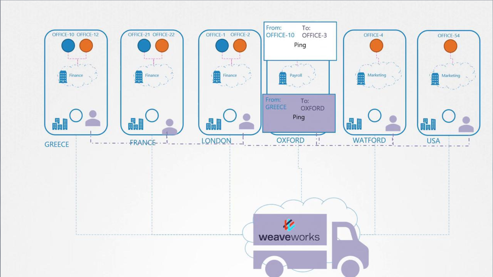

# CNI weave

## How Weave Works
-   The Weave CNI plugin deploys an agent on each Kubernetes node.
-   These agents exchange information about nodes, networks, and pods to maintain a complete topology of the cluster.
    -   Each node runs a Weave bridge, allowing dynamic IP address assignment.

-   Keep in mind that a pod may be connected to multiple bridge networks (e.g., both the Weave bridge and the Docker bridge).

-   The container's routing configuration controls the path a packet follows, and Weave ensures that each pod has the correct route through its assigned agent.
    -   When sending a packet to a pod on another node, Weave intercepts, encapsulates, and routes it using updated source and destination details. 
    -   At the destination node, the corresponding Weave agent decapsulates the packet and delivers it to the intended pod.

### Network Diagrams

