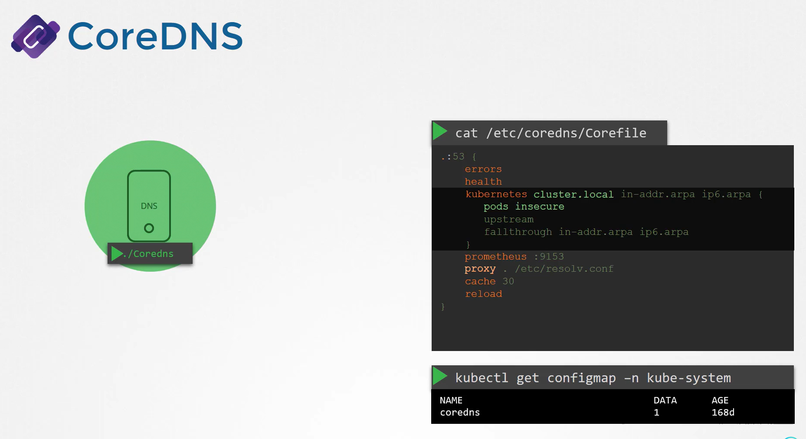

# CoreDNS in K8
We will learn how Kubernetes implements DNS resolution within a cluster to facilitate seamless communication between pods and services.


Imagine you have two pods with different IP addresses. One approach to enable communication between them is to **add an entry into each pod’s hosts file** ```/etc/hosts```. 

-   For instance, on the first pod, you might map the second pod (named "web") to IP 10.244.2.5 

-   And on the second pod, map the first pod (named "test") to IP 10.244.1.5. 

However, when dealing with thousands of pods that are frequently created and removed, manually managing these entries becomes impractical.

## Centralized DNS Approach

-   Instead of manually editing hosts files, Kubernetes deploys a central DNS server. 

-   Each pod is pre-configured via its ```/etc/resolv.conf``` file to use this centralized server (typically at 10.96.0.10), which automatically updates DNS records for new pods and services.


-   Kubernetes **does not create DNS entries for individual pods manually.**

-   Instead, it sets up **DNS records for services,** and **for pods, it converts IP addresses into hostnames by replacing dots with dashes.**


```bash
cat /etc/resolv.conf
nameserver 10.96.0.10
```

## CoreDNS Setup in the Cluster
-   CoreDNS is deployed as a **pod within the kube-system namespace.**

-   To ensure high availability, Kubernetes runs **two replicas of CoreDNS** pods managed by a ReplicaSet (now part of a Deployment)

-   Each pod runs the CoreDNS executable, which you could also run manually if deploying CoreDNS independently.


CoreDNS requires a configuration file—commonly named "Corefile" and located at ```/etc/coredns/Corefile```—that outlines various plugins used to process DNS queries. 

An example configuration is shown below:
```bash
cat /etc/coredns/Corefile
.:53 {
    errors
    health
    kubernetes cluster.local in-addr.arpa ip6.arpa {
        pods insecure
        upstream
        fallthrough in-addr.arpa ip6.arpa
    }
    prometheus :9153
    proxy . /etc/resolv.conf
    cache 30
    reload
}
```

This configuration performs the following functions:

-   Logs and handles errors.
-   Provides health check endpoints.
-   Integrates with Kubernetes via the Kubernetes plugin, **configuring the primary domain to ```cluster.local```** and **transforming pod IP addresses into a dashed hostname format.**
-   Exposes **Prometheus** metrics for **monitoring.**
-   **Forwards unresolved DNS queries** (such as www.google.com) to the nameserver specified in the pod’s ```/etc/resolv.conf```.
-   Caches DNS responses and supports dynamic reloads of the configuration upon changes.



### Note:
Note that this configuration is stored in a ***ConfigMap***. If adjustments are needed, simply update the ConfigMap:

```bash
kubectl get configmap -n kube-system
NAME      DATA   AGE
coredns   1      168d
```


## DNS Service and Pod Configuration
-   To enable pods to communicate with the CoreDNS server, Kubernetes creates a service (named kube-dns by default) with the IP address 10.96.0.10.

-   This IP is automatically set as the primary nameserver in all pod ```/etc/resolv.conf``` files

    ```bash
    kubectl get service -n kube-system
    NAME         TYPE        CLUSTER-IP     EXTERNAL-IP   PORT(S)           AGE
    kube-dns     ClusterIP   10.96.0.10     <none>        53/UDP,53/TCP     1d
    ```


-   This configuration is automatically managed by the **Kubelet**. If you inspect the Kubelet configuration file, you will find entries for both the c**luster DNS and the cluster domain:**

    ```bash
    cat /var/lib/kubelet/config.yaml
    ...
    clusterDNS:
    - 10.96.0.10
    clusterDomain: cluster.local
    ```


## Resolving Services and Pods

-   With the correct DNS configuration, **pods can resolve services** using *different domain name formats.* 

    -   For example, if you have a web service deployed in your cluster, you can access it using **any** of the following names:

        -   web-service
        -   web-service.default
        -   web-service.default.svc
        -   web-service.default.svc.cluster.local

    -   These examples are demonstrated in the commands below:

        ```bash
        cat /etc/resolv.conf
        nameserver 10.96.0.10
        curl http://web-service
        curl http://web-service.default
        curl http://web-service.default.svc
        curl http://web-service.default.svc.cluster.local
        ```

    -   You can also use tools like nslookup or host to check the fully qualified domain name:

        ```bash
        host web-service
        web-service.default.svc.cluster.local has address 10.107.37.188
        ```

        -   The search entries in ```/etc/resolv.conf``` allow the resolver to append the listed domains when you use partial names. 
        
        -   However, individual **pod names** must always be resolved with their complete **fully qualified domain name (FQDN).**

        