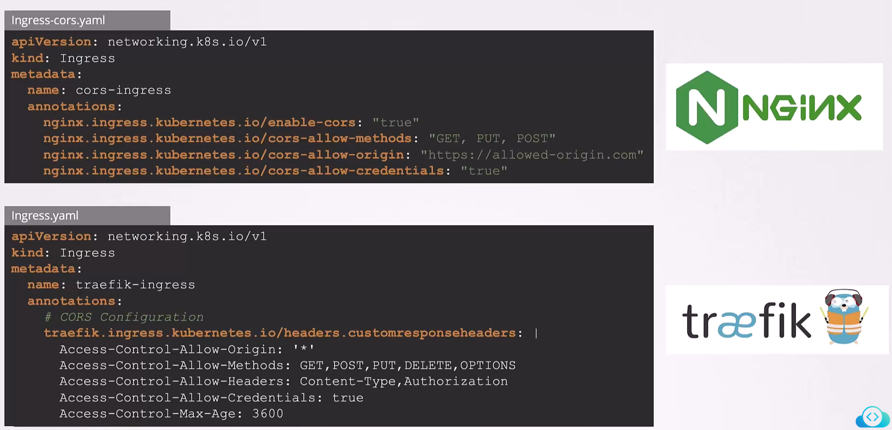

# 2025 Updates Introduction to Gateway API

-   We introduce the Gateway API, a modern, more flexible approach to managing network routing in Kubernetes.

-   In previous discussions on Ingress, we saw a scenario where **two services shared the same Ingress resource:**


## Limitations of Ingress

Imagine a scenario where **independent teams** or **even separate organizations manage different services.** 

-   For example, **one team** could be responsible for the **web service** while another oversees the **video service.** 

-   In such multi-tenant environments, a single Ingress resource — which can be controlled by only one team at a time — may lead to coordination challenges and potential conflicts. 

-   In addition, Ingress has limited support for multi-tenancy and parameterized rules.


Another limitation of Ingress is its **narrow rule configuration.** 


-   Ingress **only supports HTTP-based requests** by matching hosts or paths. 
-   It does not natively support protocols such as **TCP or UDP**, *nor does it offer advanced features like traffic splitting, header manipulation, authentication, or rate limiting*


These behaviors are usually implemented using **controller-specific *annotations***. For example:

```bash
apiVersion: extensions/v1beta1
kind: Ingress
metadata:
  name: ingress-wear-watch
  annotations:
    wear.my-online-store.com:
      nginx.ingress.kubernetes.io/ssl-redirect: "true"
      nginx.ingress.kubernetes.io/force-ssl-redirect: "true"
spec:
  rules:
    - host: wear.my-online-store.com
      http:
        paths:
          - path: /foo
            backend:
              serviceName: wear-service
              servicePort: 80
    - host: watch.my-online-store.com
      http:
        paths:
          - backend:
              serviceName: watch-service
              servicePort: 80
```


The use of annotations, however, creates challenges. 

Different Ingress implementations (such as NGINX and Traefik) **require their own annotation syntax.**

For instance, configuring CORS might look like this:
```bash
##NGINX

apiVersion: networking.k8s.io/v1
kind: Ingress
metadata:
  name: cors-ingress
  annotations:
    nginx.ingress.kubernetes.io/enable-cors: "true"
    nginx.ingress.kubernetes.io/cors-allow-methods: "GET, PUT, POST"
    nginx.ingress.kubernetes.io/cors-allow-origin: "https://allowed-origin.com"
    nginx.ingress.kubernetes.io/cors-allow-credentials: "true"
```

```bash
## TRAEFIK

apiVersion: networking.k8s.io/v1
kind: Ingress
metadata:
  name: traefik-ingress
  annotations:
    # CORS Configuration
    traefik.ingress.kubernetes.io/headers.customresponseheaders: |
      Access-Control-Allow-Origin: '*'
      Access-Control-Allow-Methods: GET,POST,PUT,DELETE,OPTIONS
      Access-Control-Allow-Headers: Content-Type,Authorization
      Access-Control-Allow-Credentials: true
      Access-Control-Max-Age: 3600
```


This is where **Gateway API** steps in. 


Gateway API is an official Kubernetes project designed to **improve both layer 4 and layer 7 routing.** 

It represents the *next evolution in Kubernetes Ingress, load balancing, and service mesh APIs.*

## Benefits of Gateway API

*One of the key limitations with Ingress is multi-tenancy.*

### Benefit 1

Gateway API addresses this by **splitting the responsibilities among three objects**, each managed by a different persona:

    
1.  **Infrastructure Providers:** They define the ```GatewayClass```, which specifies the underlying network infrastructure (e.g., NGINX, Traefik, or another load balancer).

2.  **Cluster Operators:** They create ```Gateway``` objects as instances of a GatewayClass.


3.  **Application Developers:** They configure ```HTTPRoutes``` (or other routes like TCPRoute or gRPCRoute) that attach to the Gateway.


Unlike Ingress, which only supports HTTP routing, Gateway API broadens support to include multiple protocols. 


#### 1. Defining the GatewayClass
The ```GatewayClass``` object specifies the network infrastructure controller:

```bash
apiVersion: gateway.networking.k8s.io/v1
kind: GatewayClass
metadata:
  name: example-class
spec:
  controllerName: example.com/gateway-controller
```

#### 2. Creating a Gateway
Next, define a ```Gateway``` that references the ```GatewayClass``` and sets up an **HTTP listener on port 80**:

```bash
apiVersion: gateway.networking.k8s.io/v1
kind: Gateway
metadata:
  name: example-gateway
spec:
  gatewayClassName: example-class
  listeners:
    - name: http
      protocol: HTTP
      port: 80
      allowedRoutes: 
       namespaces: 
        from: All
```

#### 3. Configuring an HTTPRoute
Application developers then create an ```HTTPRoute``` to define routing rules. 

In the following example, requests for ```"www.example.com"``` with a path prefix of ```"/login"``` are directed to the ```"example-svc"``` backend on port ```8080```:

```bash
apiVersion: gateway.networking.k8s.io/v1
kind: HTTPRoute
metadata:
  name: example-httproute
spec:
  parentRefs:
    - name: example-gateway
  hostnames:
    - "www.example.com"
  rules:
    - matches:
        - path:
            type: PathPrefix
            value: /login
      backendRefs:
        - name: example-svc
          port: 8080
```


### Benefit 2 [Streamlined TLS Termination]

Another advantage of Gateway API is its clear and structured approach to TLS configuration.

With Ingress, configuring HTTPS typically involves both native TLS settings and controller-specific annotations:

```bash
# Ingress configuration for HTTPS using annotations
apiVersion: networking.k8s.io/v1
kind: Ingress
metadata:
  name: secure-app
  annotations:
    nginx.ingress.kubernetes.io/ssl-redirect: "true"
    nginx.ingress.kubernetes.io/force-ssl-redirect: "true"
spec:
  tls:
  - hosts:
      - secure.example.com
    secretName: tls-secret
```

The equivalent configuration in Gateway API is both straightforward and self-contained:

```bash
apiVersion: gateway.networking.k8s.io/v1
kind: Gateway
metadata:
  name: secure-gateway
spec:
  gatewayClassName: example-gc
  listeners:
    - name: https
      port: 443
      protocol: HTTPS
      tls:
        mode: Terminate
        certificateRefs:
          - kind: Secret
            name: tls-secret
      allowedRoutes:
        kinds:
          - kind: HTTPRoute
```


### Benefit 3 [Traffic Splitting for Canary Deployments]
Ingress can handle traffic splitting through **controller-specific annotations**.

```bash
# Canary deployment configuration with Ingress annotations for NGINX
apiVersion: networking.k8s.io/v1
kind: Ingress
metadata:
  name: canary-ingress
  annotations:
    nginx.ingress.kubernetes.io/canary: "true"
    nginx.ingress.kubernetes.io/canary-weight: "20"
spec:
  rules:
    - http:
        paths:
          - path: /
            pathType: Prefix
            backend:
              service:
                name: app-v2
                port:
                  number: 80
```

With Gateway API, traffic splitting is declared directly in the HTTPRoute, making it more transparent:

```bash
apiVersion: gateway.networking.k8s.io/v1
kind: HTTPRoute
metadata:
  name: split-traffic
spec:
  parentRefs:
    - name: app-gateway
  rules:
    - backendRefs:
        - name: app-v1
          port: 80
          weight: 80
        - name: app-v2
          port: 80
          weight: 20
```


### Benefit 4 [Advanced Configurations: CORS]
Managing advanced configurations such as CORS with Ingress often requires multiple annotations:

```bash
# CORS configuration for NGINX using annotations
apiVersion: networking.k8s.io/v1
kind: Ingress
metadata:
  name: cors-ingress
  annotations:
    nginx.ingress.kubernetes.io/enable-cors: "true"
    nginx.ingress.kubernetes.io/cors-allow-methods: "GET, PUT, POST"
    nginx.ingress.kubernetes.io/cors-allow-origin: "https://allowed-origin.com"
    nginx.ingress.kubernetes.io/cors-allow-credentials: "true"
```

With Gateway API, CORS is configured in a centralized, declarative manner using filters:

```bash
apiVersion: gateway.networking.k8s.io/v1
kind: HTTPRoute
metadata:
  name: cors-route
spec:
  parentRefs:
    - name: my-gateway
  rules:
    - matches:
        - path:
            type: PathPrefix
            value: /api
      filters:
        - type: ResponseHeaderModifier
          responseHeaderModifier:
            add:
              - name: Access-Control-Allow-Origin
                value: "*"
              - name: Access-Control-Allow-Methods
                value: "GET, POST, PUT, DELETE, OPTIONS"
              - name: Access-Control-Allow-Headers
                value: "Content-Type,Authorization"
              - name: Access-Control-Allow-Credentials
                value: "true"
              - name: Access-Control-Max-Age
                value: "3600"
      backendRefs:
        - name: api-service
```

