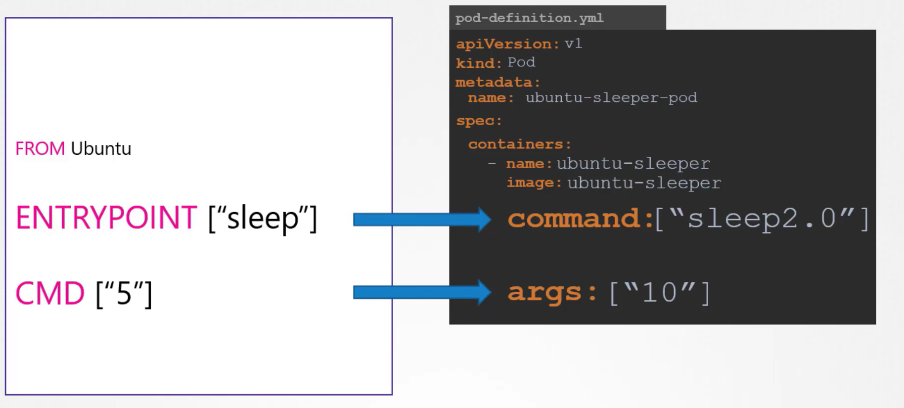

# Commands & Arguments in K8




### Remember that specifying the command in a pod definition replaces the Dockerfile's ENTRYPOINT entirely, while the args field only overrides the default parameters defined by CMD.


```bash
apiVersion: v1
kind: Pod
metadata:
  name: ubuntu-sleeper-pod
spec:
  containers:
    - name: ubuntu-sleeper
      image: ubuntu-sleeper
      command: ["sleep2.0"]
      args: ["10"]
```

### Kubectl command for **commands** and **arguments**
Default Command:
```bash
kubectl run nginx --image=nginx --command -- <cmd> <arg1> ... <argN>
```

```bash
kubectl run ubuntu-sleeper --image=ubuntu-sleeper --command -- sleep2.0 10
```

### kubectl command for **arguments** only

Default Command:
```bash
kubectl run nginx --image=nginx -- <arg1> <arg2> ... <argN>
```
Example:
```bash
kubectl run ubuntu-sleeper --image=ubuntu-sleeper -- 10
```
