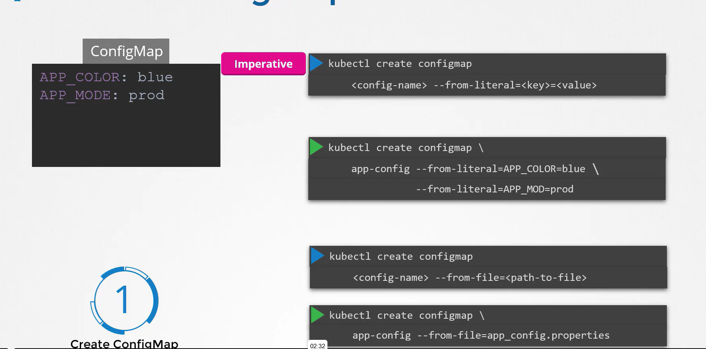
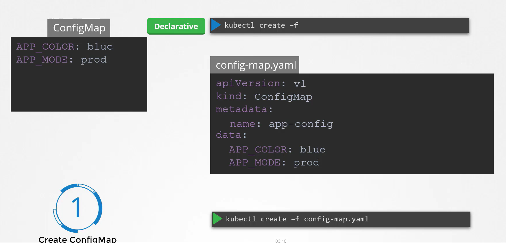
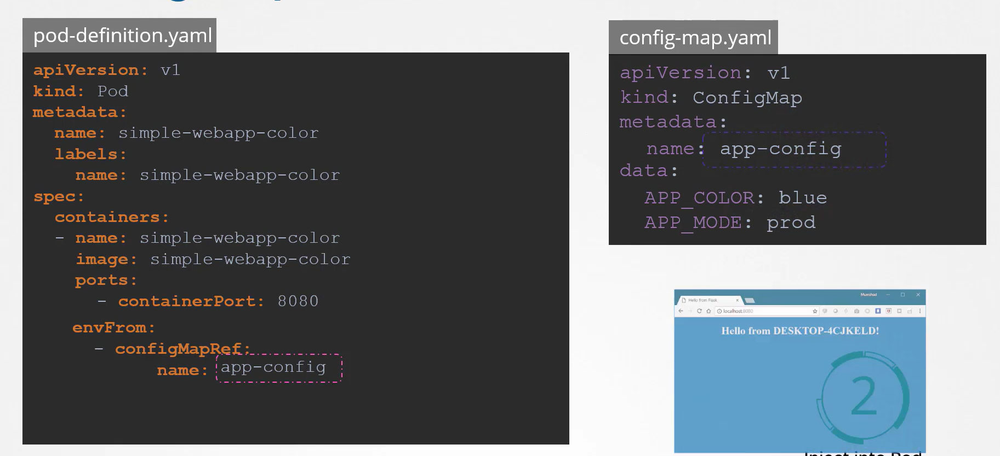

# Environment Variables in K8


## Setting Environment Variables Using Docker

```bash
docker run -e APP_COLOR=pink simple-webapp-color
```

## Configuring Environment Variables in Kubernetes Pods

```bash
apiVersion: v1
kind: Pod
metadata:
    name: Pod-name
spec:
    containers:
        -   image: image_name
            name: name

        ports:
            -   containerPort: 8080

        env:
            -   name: APP_COLOR
                value:  pink 
```

## Leveraging ConfigMaps and Secrets for Environment Variables

-   Instead of hardcoding values into your pod manifest, you can enhance flexibility and security by referencing external configuration sources such as **ConfigMaps** or **Secrets**.

-   This approach simplifies maintenance and helps protect sensitive information.

### To define an environment variable directly, use:

```bash
env:
  - name: APP_COLOR
    value: pink
```

### To reference a ConfigMap for the environment variable, update the definition as follows:
```bash
env:
  - name: APP_COLOR
    valueFrom:
      configMapKeyRef:
        name: app-config
        key: color
```
### Similarly, to source the environment variable from a Secret, configure it like this:
```bash
env:
  - name: APP_COLOR
    valueFrom:
      secretKeyRef:
        name: app-secrets
        key: color
```

## Warning

-   Avoid hardcoding sensitive data directly into your manifests. Always use Secrets when dealing with sensitive information such as **passwords** or **API keys**.


Imperative Approach



Declarative Approach


View Config Map:


## ConfigMap in Pods

