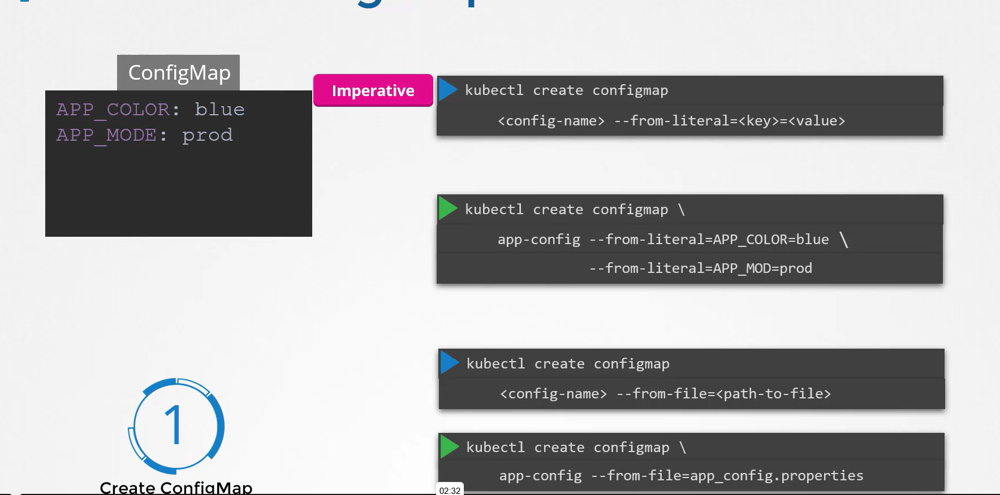
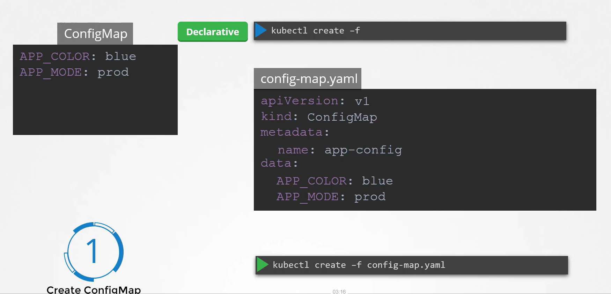
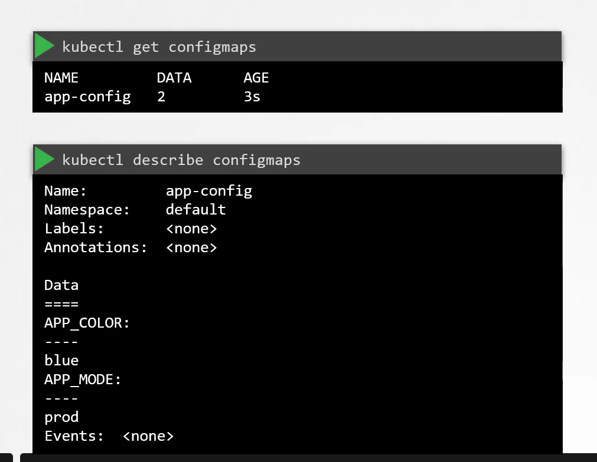
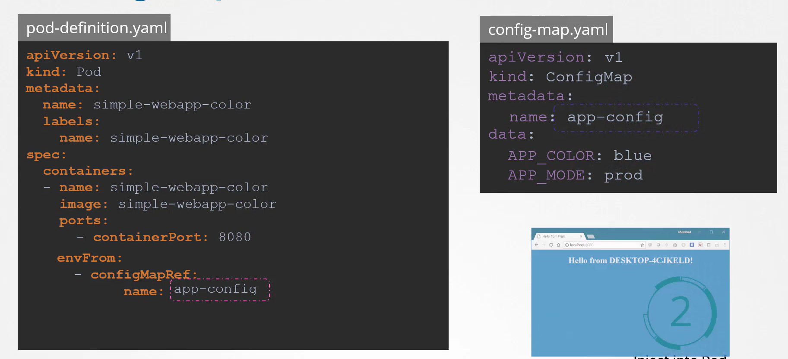

# Configure ConfigMaps in Applications

-    Instead of hard-coding environment variables in each pod definition, **ConfigMaps** allow you to centrally manage **key–value pairs**, making your Kubernetes configurations easier to maintain and scale.

## Using Environment Variables in a Pod

-   Traditionally, environment variables are set directly within the pod specification

```bash
apiVersion: v1
kind: Pod
metadata:
  name: simple-webapp-color
spec:
  containers:
    - name: simple-webapp-color
      image: simple-webapp-color
      ports:
        - containerPort: 80
  env:
    - name: APP_COLOR
      value: blue
    - name: APP_MODE
      value: prod
```

## Centralizing Configuration with ConfigMaps

-   To simplify the management of environment configurations, you can externalize the data using a ConfigMap. 

-   With this approach, Kubernetes injects centrally stored key–value pairs into your pods during creation.


**Assume that the ConfigMap (named app-color) holds the following key–value pairs:**
```bash
APP_COLOR: blue
APP_MODE: prod
```

```bash
apiVersion: v1
kind: Pod
metadata:
  name: simple-webapp-color
spec:
  containers:
    - name: simple-webapp-color
      image: simple-webapp-color
      ports:
        - containerPort: 80
  envFrom:
    - configMapRef:
        name: app-color
```

## Creating ConfigMaps

1.  Imperative Approach
2.  Declarative Approach


### 1. Imperative Approach
-   If you prefer using the **command line** without a definition file, you can create a **ConfigMap** directly by **specifying key–value pairs.**

```bash
kubectl create configmap app-config --from-literal=APP_COLOR=blue --from-literal=APP_MOD=prod
```
You can also generate a **ConfigMap** from a **file** using the -**-from-file** option.
```bash
kubectl create configmap app-config --from-file=app_config.properties
```




### 2. Declarative Approach
-   With a declarative approach, you define your ConfigMap in a **YAML file** and apply it with **kubectl**.

```bash
apiVersion: v1
kind: ConfigMap
metadata:
  name: app-config
data:
  APP_COLOR: blue
  APP_MODE: prod
```

```bash
kubectl create -f config-map.yaml
```



## View Config Map:

```bash
kubectl get configmaps
```

```bash
kubectl describe configmaps
```



## ConfigMap in Pods

```bash
# pod-definition.yaml
apiVersion: v1
kind: Pod
metadata:
  name: simple-webapp-color
  labels:
    name: simple-webapp-color
spec:
  containers:
    - name: simple-webapp-color
      image: simple-webapp-color
      ports:
        - containerPort: 8080
  envFrom:
    - configMapRef:
        name: app-config
```
The corresponding ConfigMap definition might look like this:
```bash
# config-map.yaml
apiVersion: v1
kind: ConfigMap
metadata:
  name: app-config
data:
  APP_COLOR: blue
  APP_MODE: production
```

