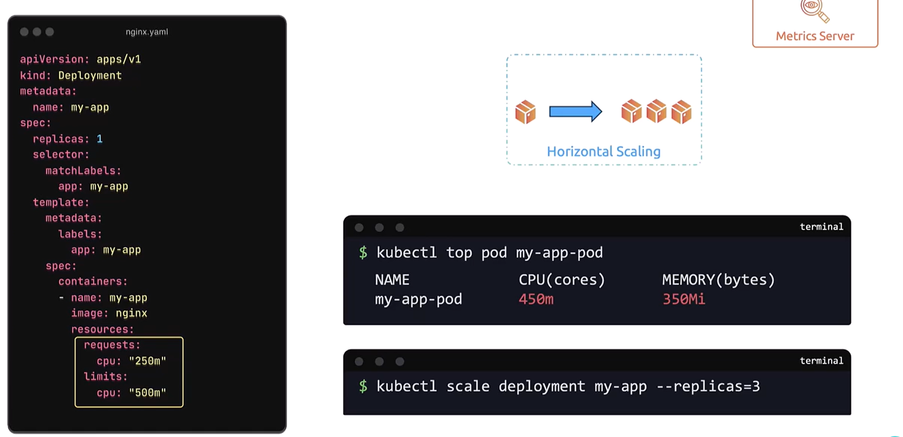

# Horizontal Pod Autoscaler (HPA)
-   HPA is a key feature that **automates scaling of workloads** based on resource usage, reducing the manual monitoring overhead for administrators.

## Manual Horizontal Scaling

To monitor the pod’s resource consumption manually, you might run:

```bash
$ kubectl top pod my-app-pod
NAME         CPU(cores)   MEMORY(bytes)
my-app-pod   450m         350Mi
```

When resource usage reaches a predefined threshold (e.g., 450 mCPU), you must manually scale the deployment:
```bash
kubectl scale deployment my-app --replicas=3
```



**Manually scaling pods requires continuous monitoring, which can be resource-intensive and error-prone during traffic surges.**

## Automated Scaling with Horizontal Pod Autoscaler

-   HPA monitors resource metrics—including **CPU, memory, and custom metrics**—using the **metrics server**. 

    -   When usage exceeds a defined threshold, it automatically adjusts the number of pod replicas in deployments, stateful sets, or replica sets.

-   When CPU or memory usage is **high**, HPA **scales up the number of pods**; when usage **drops**, **it scales them down to conserve system resources**. HPA can even track multiple metrics concurrently.

### 1. Imperative Approach

```bash
 kubectl autoscale deployment my-app --cpu-percent=50 --min=1 --max=10
```

```bash
kubectl get hpa
```

```bash
kubectl delete hpa my-app
```


### 2. Declarative Approach

```bash
apiVersion: autoscaling/v2
kind: HorizontalPodAutoscaler
metadata:
  name: my-app-hpa
spec:
  scaleTargetRef:
    apiVersion: apps/v1
    kind: Deployment
    name: my-app
  minReplicas: 1
  maxReplicas: 10
  metrics:
  - type: Resource
    resource:
      name: cpu
      target:
        type: Utilization
        averageUtilization: 50
```
