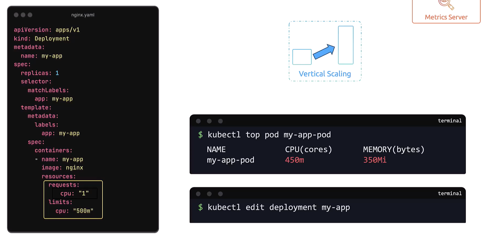

# Vertical Pod Autoscaling (VPA)
-   Vertical Pod Autoscaler (VPA) in Kubernetes and **how it automatically manages resource allocation**.


## Manual Vertical Scaling

```bash
apiVersion: apps/v1
kind: Deployment
metadata:
  name: my-app
spec:
  replicas: 1
  selector:
    matchLabels:
      app: my-app
  template:
    metadata:
      labels:
        app: my-app
    spec:
      containers:
      - name: my-app
        image: nginx
        resources:
          requests:
            cpu: "250m"
          limits:
            cpu: "500m"
```
-   Ensure that your cluster has the metrics server running to collect these metrics. 

### Note:
-   When resource usage reaches a set threshold, you must **manually update the deployment** *(e.g., using kubectl edit deployment)* to adjust CPU requests and limits. 

    -   This update replaces the running pod with a new one using the new configuration.



## Vertical Pod Autoscaler (VPA)

-   Manually updating resources can be **error-prone** and **time-consuming**. 

-   The **VPA automates this process**, continuously *monitoring metrics* and *adjusting CPU* and *memory allocations* for pods.

### Note
 -  VPA is not included by default in Kubernetes clusters. 
 
 -  You must deploy it separately from its GitHub repository. 
    -  After deployment, verify its three components—the recommender, updater, and admission controller—using the commands below:

```bash
 kubectl apply -f https://github.com/kubernetes/autoscaler/releases/latest/download/vertical-pod-autoscaler.yaml


$ kubectl get pods -n kube-system | grep vpa
vpa-admission-controller-xxxx   Running
vpa-recommender-xxxx            Running
vpa-updater-xxxx                Running
```

The components work as follows:

    1. VPA Recommender: Continuously monitors resource usage via the Kubernetes metrics API, aggregates historical and live data, and provides recommendations for optimal CPU and memory allocations.

    2. VPA Updater: Evaluates running pods against recommendations, evicting those with suboptimal resource requests.

    3. VPA Admission Controller: Intercepts the pod creation process and mutates pod specifications based on the recommender's suggestions, ensuring new pods start with proper resource allocations.

## Configuring the VPA
-   To create a VPA for your deployment, **use a YAML configuration file** rather than running **imperative commands**.

```bash
apiVersion: autoscaling.k8s.io/v1
kind: VerticalPodAutoscaler
metadata:
  name: my-app-vpa
spec:
  targetRef:
    apiVersion: apps/v1
    kind: Deployment
    name: my-app
  updatePolicy:
    updateMode: "Auto"
  resourcePolicy:
    containerPolicies:
    - containerName: "my-app"
      minAllowed:
        cpu: "250m"
      maxAllowed:
        cpu: "2"
      controlledResources: ["cpu"]
```

The VPA supports multiple update modes:

    1. Off: Only provides recommendations without any modifications.

    2. Initial: Applies recommendations only to newly created pods.

    3. Recreate: Evicts pods running with suboptimal resource allocations, leading to pod restarts.

    4. Auto: Currently behaves like "recreate" by evicting pods to apply updated values. In the future, auto mode may support in-place updates without restarting pods.

List
```bash
kkubectl get deployments -n kube-system | grep vpa
```

To view the VPA recommendations, run:

```bash
$ kubectl describe vpa my-app-vpa
Recommendations:
  Target:
    Cpu: 1.5
```