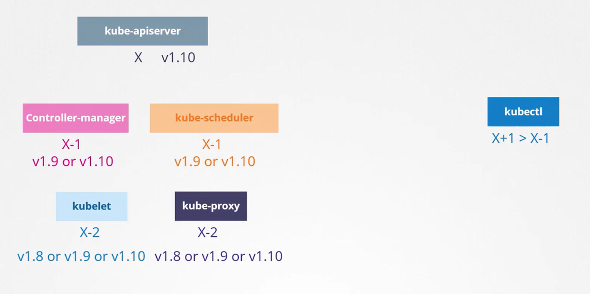
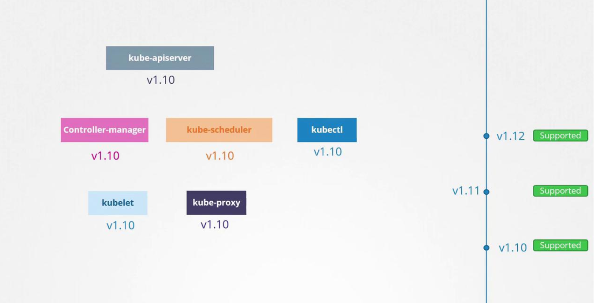
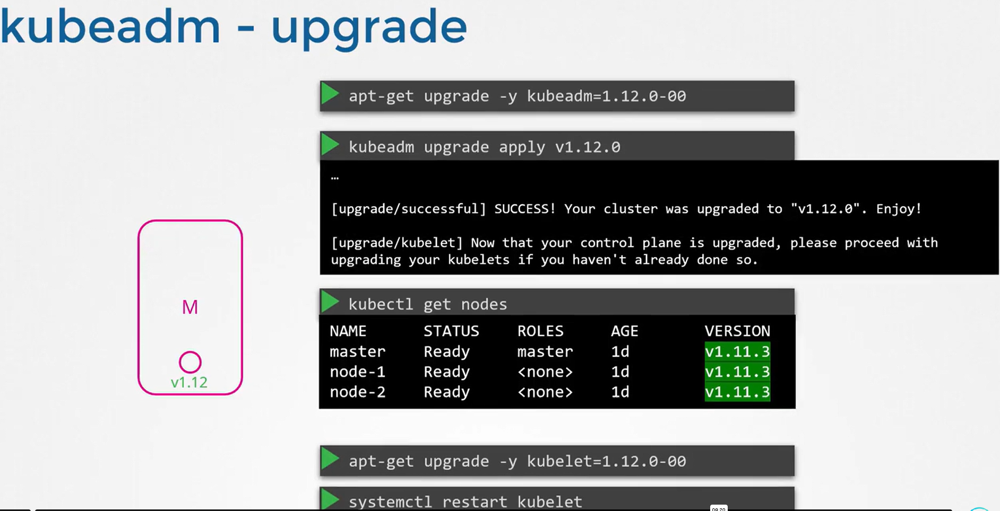
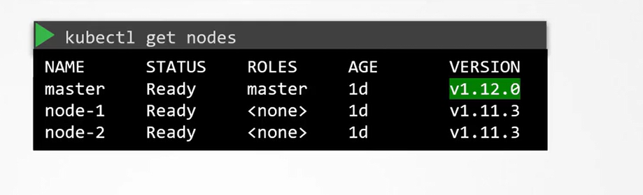

# Cluster Upgrade Introduction

-   We will explain the upgrade process focusing on the **core control plane components, while keeping external dependencies** like *ETCD* and *CoreDNS* aside.

-   It is important to note that **not all components are required to run on the same version**

-   Although different components can operate on varying release versions, the **Kube API Server remains the primary control plane** component that all others communicate with.
    -   Consequently, **no component should ever run on a version higher than the API Server**
        -   The **controller manager** and **scheduler** may be *one version lower than the API Server*.

        -   The **Kubelet** and **Kube Proxy components** may be *two versions lower than the API Server.*



For instance, if the API Server is at version 1.10, then:

-   The **controller manager** and **scheduler** can run on *version 1.10 or 1.9.*
-   The **Kubelet** and **Kube Proxy** can run on *version 1.8*. 
    -   *Running any component on a version higher than the API Server (e.g., 1.11 when the API Server is 1.10) is not recommended.*

### Note
**The Kube Control utility(kubectl) is an exception and may run on a version that is higher, lower, or the same as the API Server.** 
-   This flexibility supports live, rolling upgrades where components can be upgraded individually.


## When to Upgrade
Suppose you're running *Kubernetes 1.10*, and *new releases 1.11* and *1.12* are available. 
-   Kubernetes officially **supports up to the three most recent minor versions**. 

-   With *1.12* as the latest, the supported versions are *1.12, 1.11, and 1.10.* 

-   When version *1.13* is released, only *1.13, 1.12, and 1.11* will be supported. 

-   It is advisable to upgrade your cluster to the next release before support for your current version is dropped.


An **effective upgrade strategy** is to **upgrade one minor version at a time** (e.g., upgrade from 1.10 to 1.11, then from 1.11 to 1.12, and finally from 1.12 to 1.13) rather than attempting a large jump between versions.



## Upgrade Process Overview
Consider a **production cluster with master and worker nodes running version 1.10.** 

The upgrade process generally involves two major steps:

### 1. Upgrading the master nodes.

During the master node upgrade, control plane components (such as the API server, scheduler, and controller managers) experience a brief interruption.

-   Although management functionality (like kubectl commands or scaling deployments) is paused, the worker nodes continue to run and deliver applications.

-   However, keep in mind that if any pods fail during this period, they might not be restarted automatically.

-   Once the master upgrade is complete, normal control plane operations resume.


After the master nodes are upgraded, the next step is to upgrade the worker nodes. 

###  Upgrade Strategies

#### Strategy 1
-   Upgrade all worker nodes simultaneously (which may result in downtime).

#### Strategy 2
-   Upgrade one worker node at a time, allowing workloads to be shifted and ensuring continuous service.

#### Strategy 3
-   Add new nodes with the updated software version, migrate workloads to these new nodes, and then decommission the older nodes.


### Upgrading with Kubeadm
Suppose you want to upgrade your cluster from version 1.11 to 1.13. 
```bash
kubeadm upgrade plan
```

This command provides useful information such as:

-   The current cluster version.
-   The version of the kubeadm tool.
-   The latest stable version of Kubernetes.
-   A list of control plane components along with their current versions and the target upgrade versions.


Remember that after upgrading the control plane components, you must manually upgrade the kubelet on each node—**kubeadm does not manage kubelet upgrades**

**Also, the kubeadm tool itself should be upgraded before initiating the cluster upgrade.**

Because upgrades are performed one minor version at a time, if you're on version 1.11 and wish to reach 1.13, you must first upgrade to 1.12. The process is as follows:

### A. Upgrading the Master Nodes
#### 1.  Upgrade the kubeadm tool to version 1.12.
#### 2.  Upgrade the cluster using the command provided by the upgrade plan. 
This command downloads the necessary images and upgrades the control plane components.

```bash
apt-get upgrade -y kubeadm=1.12.0-00
kubeadm upgrade apply v1.12.0
# Output:
# [upgrade/successful] SUCCESS! Your cluster was upgraded to "v1.12.0". Enjoy!
# [upgrade/kubelet] Now that your control plane is upgraded, please proceed with upgrading your kubelets if you haven't already done so.
```


Note that if you run:
```bash
kubectl get nodes
```
The master node might still appear as 1.11 because this command displays the version of the kubelet registered on the node, not necessarily the API Server version.

#### 3. Upgrade the kubelet
Upgrade the kubelet by using your package manager and then restart the kubelet service.
```bash
apt-get upgrade -y kubelet=1.12.0-00

systemctl restart kubelet
```





### B. Upgrading Worker Nodes
Upgrading worker nodes should be done one at a time. 

**The recommended approach is to drain one worker node** to ensure the applications remain available on other nodes. 
```bash
kubectl drain node-1
```
After draining the node, upgrade the kubeadm and kubelet packages on the worker node using the same process as with the master node.

**For KUBEADM**
```bash
apt-get upgrade -y kubeadm=1.12.0-00
kubeadm upgrade apply v1.12.0
```

**For KUBELET**
```
apt-get upgrade -y kubelet=1.12.0-00
systemctl restart kubelet
```
**Finally mark the node as schedulable**
```bash
kubectl uncordon node-1
```

### C. Repeat this procedure for each worker node until the entire cluster is updated.

### D. Then upgrade to 1.13, following the above process consistently.