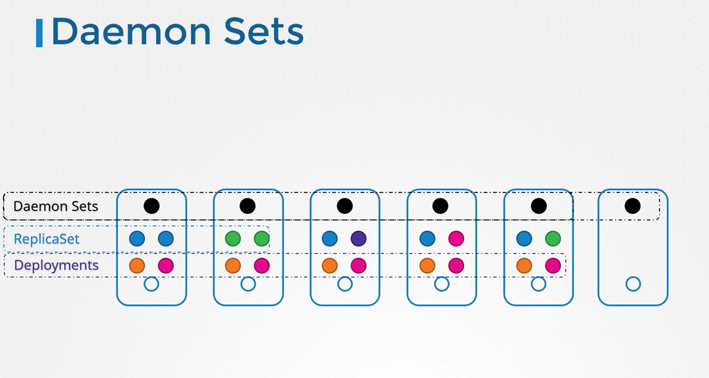

# Daemon Sets
-   DaemonSets ensure that exactly one copy of a pod runs on every node in your Kubernetes cluster.

-   When you add a new node, the DaemonSet automatically deploys the pod on the new node.

-   Likewise, when a node is removed, the corresponding pod is also removed.

-   This guarantees that a single instance of the pod is consistently available on each node.




## Use Cases for DaemonSets


-   They are particularly useful in scenarios where you need to run background services or agents on every node. Some common use cases include:

    -   **Monitoring agents and log collectors:** Deploy monitoring tools or log collectors across every node to ensure comprehensive cluster-wide visibility without manual intervention.

    -   **Essential Kubernetes components:** Deploy critical components, such as kube-proxy, which Kubernetes requires on all worker nodes.
    
    -   **Networking solutions:** Ensure consistent deployment of networking agents like those used in VNet or weave-net across all nodes.


## Creating a DaemonSet
Same as ReplicaSet, only kind is different

```bash
apiVersion: apps/v1
kind: DaemonSet
metadata:
  name: monitoring-daemon
spec:
  selector:
    matchLabels:
      app: monitoring-agent
  template:
    metadata:
      labels:
        app: monitoring-agent
    spec:
      containers:
        - name: monitoring-agent
          image: monitoring-agent
```

Create DaemonSets
```bash
kubectl create -f daemon-set-definition.yaml
```
Get DaemonSets
```bash
kubectl get daemonsets
kubectl get daemonsets -A   # All Namespaces
```

Describe
```bash
kubectl describe daemonset monitoring-daemon
```

### NOTE
An easy way to create a DaemonSet is to first generate a YAML file for a Deployment with the command 

```bash
kubectl create deployment elasticsearch --image=registry.k8s.io/fluentd-elasticsearch:1.20 -n kube-system --dry-run=client -o yaml > fluentd.yaml.
``` 

Next, remove the *replicas*, *strategy* and *status* fields from the YAML file using a text editor. Also, change the kind from *Deployment* to *DaemonSet*.

Finally, create the Daemonset by running ```kubectl create -f fluentd.yaml```