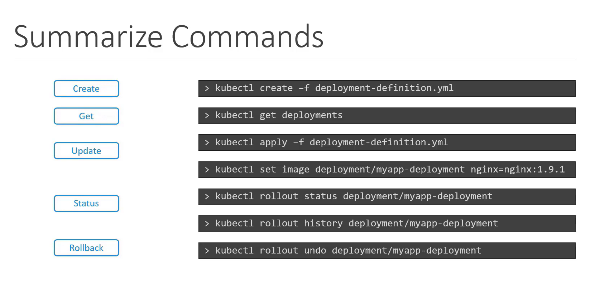

# Deployments

```bash
kubectl get all 
```

```bash
apiVersion: apps/v1
kind: Deployment
metadata:
  name: myapp-deployment
  labels:
    app: myapp
    type: front-end
spec:
  replicas: 3
  selector:
    matchLabels:
      type: front-end
  template:
    metadata:
      name: myapp-pod
      labels:
        app: myapp
        type: front-end
    spec:
      containers:
      - name: nginx-container
        image: nginx

```

```bash
kubectl create -f deployement.yml
```

```bash
kubectl get deployments
```

```bash
kubectl describe deployment myapp-deployment
```

```bash
kubectl create deployment <deployment_name> --image=<image_name> --replicas=<no>
```

## Deployment Strategy
1. Destroy & Recreate
2. Rolling Update 


### Make Upgrades 

1. By changing the YML file
```bash
kubectl apply -f deployment-definition.yml
```

2. By command (NOTE : this doesn't change the yml file)
```bash
kubectl set image deployment/myapp-deployment nginx-container=nginx:1.9.1
```


## Deployment Rollout and Versioning


## How K8 does deployment upgrades

1. Create a new replica set 
2. Start deploying new pods while stopping old pods in old replica set


## Details
```bash
kubectl rollout status deployment/myapp-deployment
```

```bash
kubectl rollout history deployment/myapp-deployment
```


## Rollback upgrades
```bash
kubectl rollout status deployment/myapp-deployment
```

```bash
kubectl rollout undo deployment/myapp-deployment
```

## Summary
