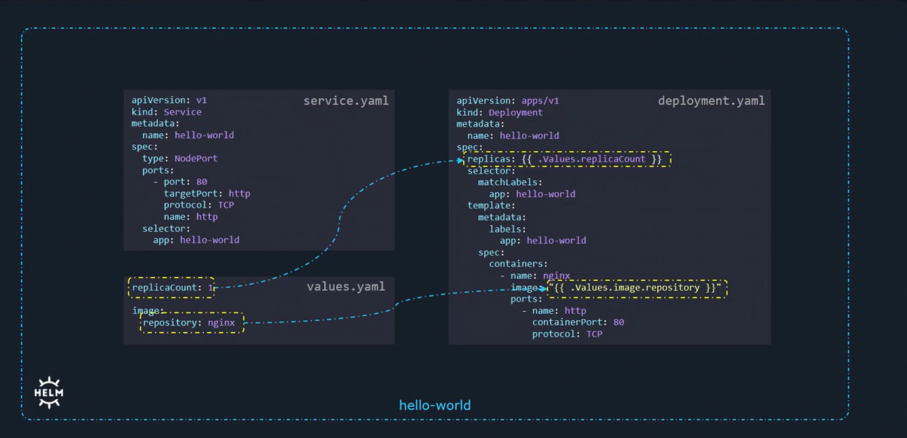
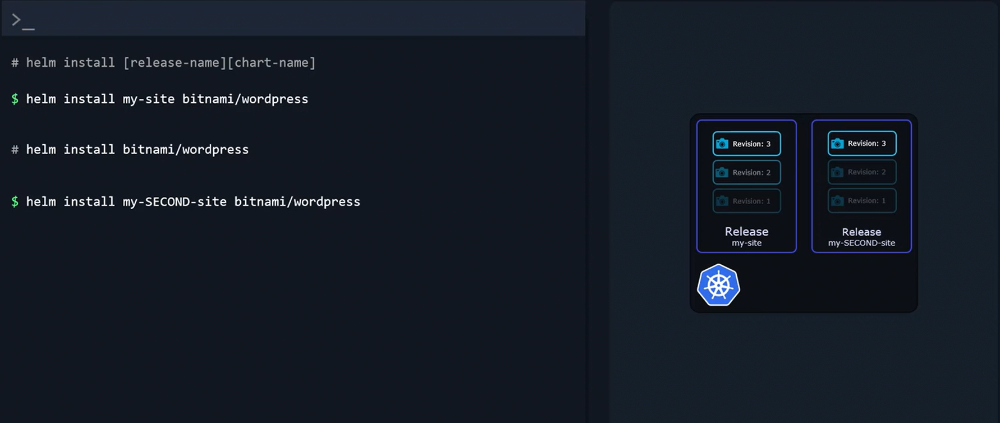
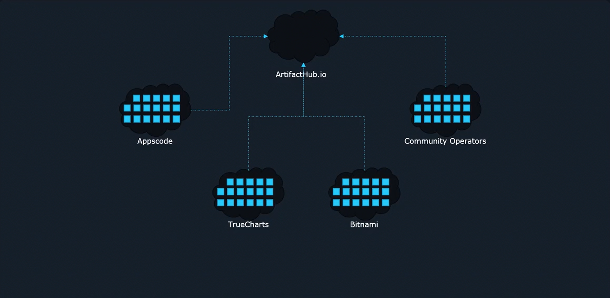

# Helm Components

## Helm CLI and Overall Structure

-   **The Helm CLI**is the command-line tool installed on your local machine. 

    -   It enables you to perform actions such as **installing, upgrading, and rolling back applications.**

-   **A Helm chart** is a collection of files that contains all the instructions needed to create the Kubernetes objects required by your application. 

    -   When you deploy a chart, Helm creates a release.

    -   **Each installation becomes a release**, and **updating the application** *(by modifying configurations like image versions or replica counts)* **results in a new revision of that release.**

-   **Helm stores metadata not on your local system** but within your Kubernetes cluster as **Kubernetes secrets.**

    -   This ensures that metadata stays accessible to anyone working with the cluster and persists through cluster restarts.


## Charts and Templating
-   Helm charts are **packages that include several resource definition files, such as templates for Deployments, Services, and more.**

    -   The **templating mechanism allows you to separate configuration values** *(for example, those provided in a values.yaml file)* **from the resource definitions.**


Consider the following basic example for a simple HelloWorld application deploying an Nginx-based web server:

```bash
# service.yaml
apiVersion: v1
kind: Service
metadata:
  name: hello-world
spec:
  type: NodePort
  ports:
    - port: 80
      targetPort: http
      protocol: TCP
      name: http
  selector:
    app: hello-world
```


```bash
# deployment.yaml
apiVersion: apps/v1
kind: Deployment
metadata:
  name: hello-world
spec:
  replicas: {{ .Values.replicaCount }}
  selector:
    matchLabels:
      app: hello-world
  template:
    metadata:
      labels:
        app: hello-world
    spec:
      containers:
        - name: nginx
          image: "{{ .Values.image.repository }}"
          ports:
            - name: http
              containerPort: 80
              protocol: TCP
```


```bash
# values.yaml
replicaCount: 1
image:
  repository: nginx
```

In this example, **templating substitutes values from the values.yaml file into the resource definitions.** This strategy makes it simple to customize your application without modifying the underlying templates.



## Helm Releases

-   **Every deployment** of a Helm chart **results in a new release**.

    -   **Releases allow you to run multiple instances of the same chart concurrently,** with each release maintaining its own revision history.

    -   This functionality is especially useful when you need separate releases for production and development environments, even though they may be based on the same chart.

For instance, you can deploy multiple instances of a WordPress website using distinct release names:
```bash
# helm install [release-name] [chart-name]
$ helm install my-site bitnami/wordpress
$ helm install my-second-site bitnami/wordpress
```

**Each release is tracked independently, allowing you to manage, upgrade, or roll back installations individually.**




## Helm Repositories and Artifact Hub

-   Helm charts are available across numerous public repositories managed by providers such as **Appscode, Community Operators, TrueCharts, and Bitnami**.
    -   Instead of searching through each repository separately, **Artifact Hub** aggregates these resources in one convenient location.

Link: https://artifacthub.io/   

