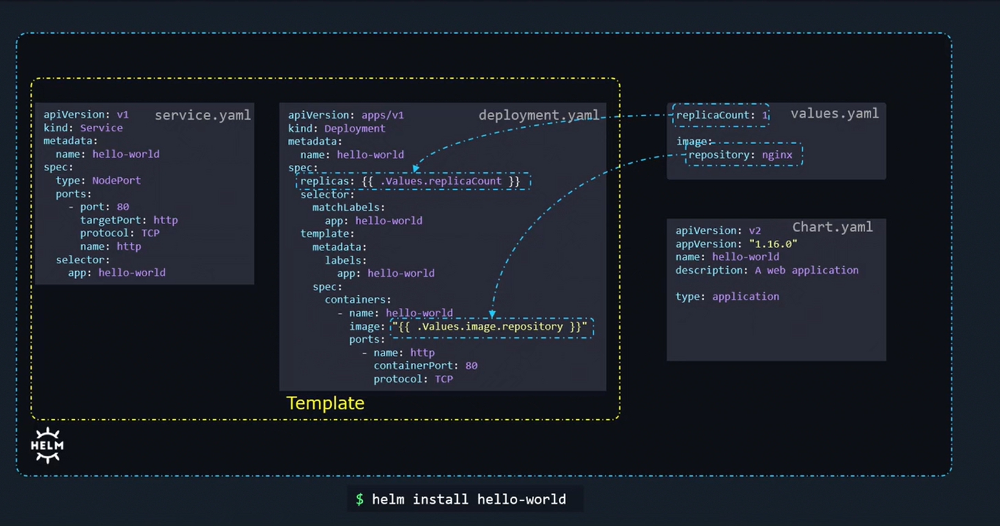
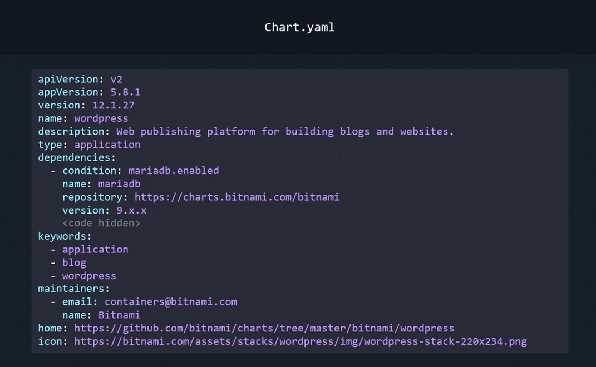
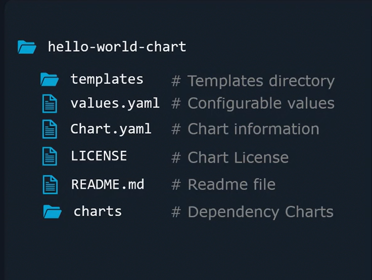

# Helm Charts
-   Charts are essentially instruction manuals composed of multiple text files, each serving a specific purpose. 
    -   One of the key files is the **values.yaml file**, which defines configuration parameters. 

    -   **These parameters are referenced within template files** to generate the final Kubernetes manifest files used to create objects.

## Hello-World Helm Chart Example
```bash
#service.yaml
apiVersion: v1
kind: Service
metadata:
  name: hello-world
spec:
  type: NodePort
  ports:
    - port: 80
      targetPort: http
      protocol: TCP
      name: http
  selector:
    app: hello-world
```

```bash
#deployment.yaml
apiVersion: apps/v1
kind: Deployment
metadata:
  name: hello-world
spec:
  replicas: {{ .Values.replicaCount }}
  selector:
    matchLabels:
      app: hello-world
  template:
    metadata:
      labels:
        app: hello-world
    spec:
      containers:
        - name: hello-world
          image: "{{ .Values.image.repository }}"
          ports:
            - name: http
              containerPort: 80
              protocol: TCP
```

```bash
#values.yaml
replicaCount: 1
image:
  repository: nginx
```

When you run the following command ```helm install hello-world```, Helm uses the templates alongside the values file to generate the **final Kubernetes manifest files**.

## Chart Metadata with Chart.yaml
-   In addition to the ```values.yaml``` file, every Helm chart includes a ```Chart.yaml``` file. 

-   This file contains **essential metadata such as the API version, app version, name, description, and chart type.**


Consider the following Chart.yaml for the "hello-world" application:

```bash
apiVersion: v2
appVersion: "1.16.0"
name: hello-world
description: A web application
type: application
```



### Compatibility Warning

-   If you encounter a **chart that lacks an API version field,** **it is likely built for Helm 2.** 

-   Attempting to deploy such charts with Helm 3 might result in unexpected behavior. Always verify the chart version before installation.


### Comprehensive Example: Deploying WordPress
-   **appVersion** field represents the version of the WordPress application, while the **version** field tracks the chart version.

```bash
apiVersion: v2
appVersion: 5.8.1
version: 12.1.27
name: wordpress
description: Web publishing platform for building blogs and websites.
type: application
dependencies:
  - condition: mariadb.enabled
    name: mariadb
    repository: https://charts.bitnami.com/bitnami
    version: 9.x.x
keywords:
  - application
  - blog
  - wordpress
maintainers:
  - email: containers@bitnami.com
    name: Bitnami
home: https://github.com/bitnami/charts/tree/master/bitnami/wordpress
icon: https://bitnami.com/assets/stacks/wordpress/img/wordpress-stack-220x234.png
```




## Chart Directory Structure

Helm charts are organized in a standard directory structure. 

At a minimum, a chart directory includes:
    
1.  **Templates directory:** Contains all the template files (e.g., Service and Deployment manifests).
2.  **values.yaml file:** Provides the default configuration values.
3.  **Chart.yaml file:** Holds metadata about the chart.

Additional files such as a 
1.  **LICENSE** or 
2.  **README**, and 
3.  **directories like charts** (for dependent charts) might also be included.



### Installing the WordPress Chart
```bash
$ helm repo add bitnami https://charts.bitnami.com/bitnami
$ helm install my-release bitnami/wordpress
```