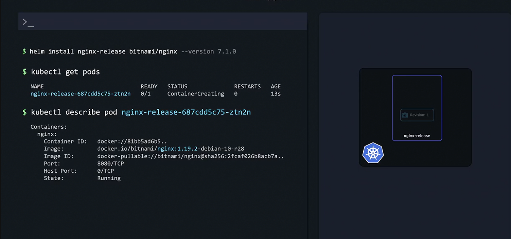
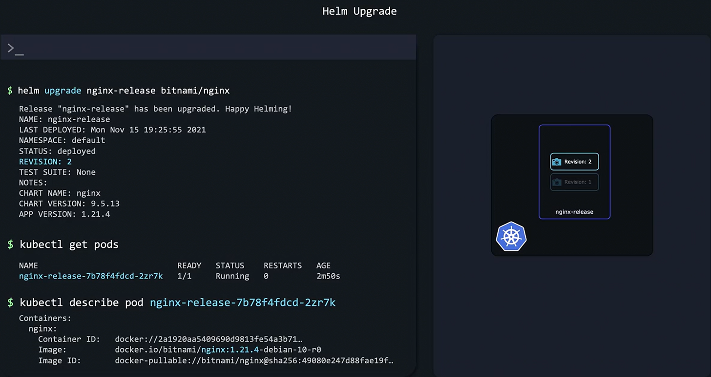
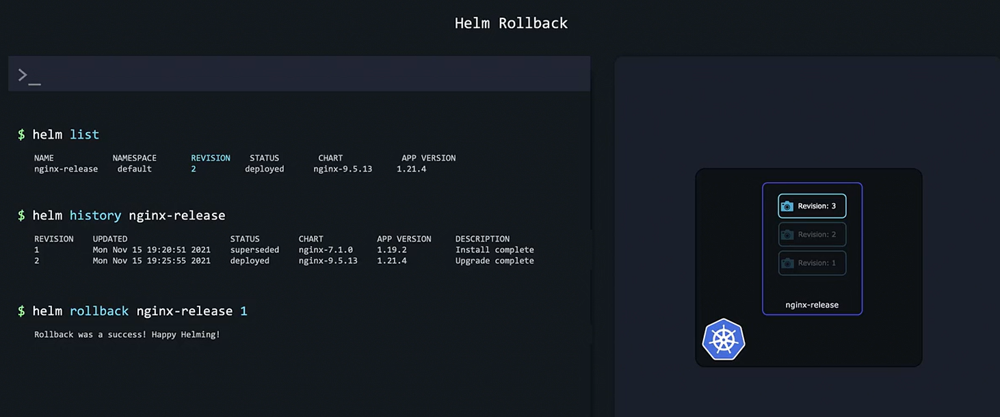

# Life Cycle Management
-   Helm packages Kubernetes objects into releases, allowing you to install, upgrade, and roll back configurations with ease.

-   Every time you install a chart, Helm creates a release that tracks all associated Kubernetes objects.


## Creating a New Release
We install an older version of the NGINX chart using the ```--version``` option
```bash
helm install nginx-release bitnami/nginx --version 7.1.0
```
Output:
```bash
kubectl get pods
NAME                                    READY   STATUS             RESTARTS   AGE
nginx-release-687cdd5c75-ztn2n         0/1     ContainerCreating  0          13s
```

After installation, you might see that the running **NGINX pod uses version 1.19.2**—a version that, at this point, is **considered outdated**. 

Later on, **if security vulnerabilities emerge or improvements are required,** Helm can *update* your application **without manually modifying each object**.




## Upgrading a Release
Before upgrading, you can verify the current version by describing the pod:
```bash
kubectl describe pod nginx-release-687cdd5c75-ztn2n
```

Output:
```bash
Containers:
  nginx:
    Container ID:   docker://81bb5ad6b5...
    Image:          docker.io/bitnami/nginx:1.19.2-debian-10-r28
    Image ID:       docker-pullable://bitnami/nginx@sha256:2fcaf026b8acb7a...
    Port:           8080/TCP
    Host Port:      0/TCP
    State:          Running
```

To upgrade the release, execute the following command. In doing so, **Helm replaces the old pod with a new one running the updated version:**

Command
```bash
helm upgrade nginx-release bitnami/nginx
```

Output:
```bash
Release "nginx-release" has been upgraded. Happy Helming!
NAME: nginx-release
LAST DEPLOYED: Mon Nov 15 19:25:55 2021
NAMESPACE: default
STATUS: deployed
REVISION: 2
TEST SUITE: None
NOTES:
  CHART NAME: nginx
  CHART VERSION: 9.5.13
  APP VERSION: 1.21.4
```
You can confirm the upgrade by checking the pod details again—the new pod should be running NGINX version 1.21.4.



## Reviewing Release History
Commands
```bash
helm list
```

```bash
helm history
```


## Rolling Back a Release
Command
```bash
helm rollback nginx-release 1
```

Output:
```bash
Rollback was a success! Happy Helming!
```

### Important

Helm requires **access to specific administrative passwords** to **upgrade certain configurations**, particularly for **external services like databases.** 

If these **credentials are not provided** during an upgrade, you will **encounter errors**. 

Consider implementing dedicated backup and restore strategies (often via Chart Hooks) for persistent data stored on volumes or in external databases.