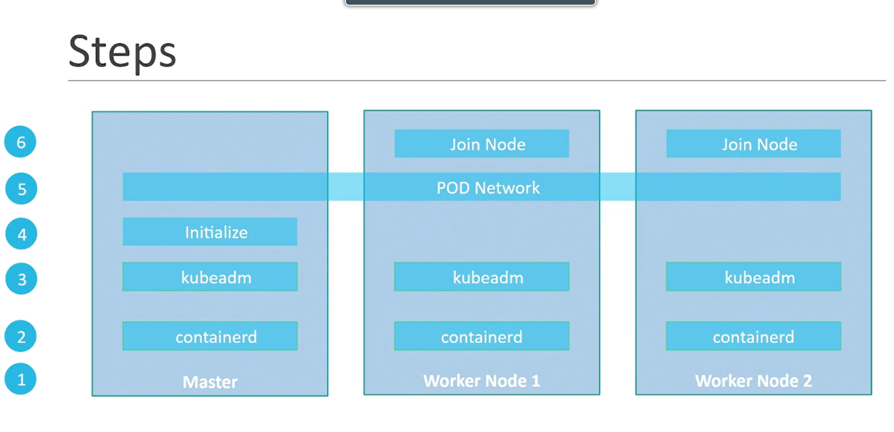

# RHEL 




## 1. Pre-requisites
### Update the hostname
```bash
hostnamectl hostname master     #For master node
hostnamectl hostname worker01   #For worker node
```

### Update ```vi /etc/hosts```
```bash
192.168.10.69   master
192.168.10.70   worker1
```

### Disable Swap on Cluster Nodes
```bash
sudo sed -i '/swap/s/^/#/' /etc/fstab
swapon --show
sudo systemctl daemon-reload
```

### Install and configure prerequisites
**Enable IPv4 Packet Forwarding**
(Copy and paste in terminal)
```bash
cat <<EOF | sudo tee /etc/sysctl.d/k8s.conf
net.ipv4.ip_forward = 1
EOF
# Apply sysctl params without reboot
sudo sysctl --system
```
Verify that ```net.ipv4.ip_forward``` is set to 1 with:
```bash
sysctl net.ipv4.ip_forward
```
### Load Some Required Kernel Modules on Cluster Nodes
```bash
echo 'overlay
br_netfilter' | sudo tee /etc/modules-load.d/kubernetes.conf

sudo modprobe overlay
sudo modprobe br_netfilter
```


## 2.  Installing a container Run-time
### Uninstall Old Version
```bash
sudo dnf remove docker \
                  docker-client \
                  docker-client-latest \
                  docker-common \
                  docker-latest \
                  docker-latest-logrotate \
                  docker-logrotate \
                  docker-engine \
                  podman \
                  runc
```

### Setup the repository
```bash
sudo dnf -y install dnf-plugins-core
sudo dnf config-manager --add-repo https://download.docker.com/linux/rhel/docker-ce.repo
```

### Install Containerd
```bash
sudo dnf install containerd.io -y 
```

### Configuring the systemd cgroup driver for Containerd
```vi /etc/containerd/config.toml```

**Delete the contains of the file and enter below**

```bash
[plugins."io.containerd.grpc.v1.cri".containerd.runtimes.runc]
  [plugins."io.containerd.grpc.v1.cri".containerd.runtimes.runc.options]
    SystemdCgroup = true
```

```bash
[ -d /etc/containerd ] || sudo mkdir /etc/containerd
containerd config default | sudo tee /etc/containerd/config.toml
sudo sed -i '/pause:3.8/s/3.8/3.10/' /etc/containerd/config.toml
grep sandbox_image /etc/containerd/config.toml
```
```bash
sudo systemctl enable --now containerd
```

### Restart Containerd
```bash
systemctl restart containerd
systemctl status containerd
```


## 3. Installing kubeadm, kubelet and kubectl 
1. 
```bash
sudo setenforce 0
sudo sed -i 's/^SELINUX=enforcing$/SELINUX=permissive/' /etc/selinux/config
```

2. 
```bash
cat <<EOF | sudo tee /etc/yum.repos.d/kubernetes.repo
[kubernetes]
name=Kubernetes
baseurl=https://pkgs.k8s.io/core:/stable:/v1.32/rpm/
enabled=1
gpgcheck=1
gpgkey=https://pkgs.k8s.io/core:/stable:/v1.32/rpm/repodata/repomd.xml.key
exclude=kubelet kubeadm kubectl cri-tools kubernetes-cni
EOF
```

3.
```bash
sudo yum install -y kubelet kubeadm kubectl --disableexcludes=kubernetes
```

4.
```bash
sudo systemctl enable --now kubelet
```
```bash
firewall-cmd --add-port=6443/tcp --permanent
firewall-cmd --add-port=10250/tcp --permanent
firewall-cmd --reload
firewall-cmd --list-all
```

```bash
sudo kubeadm init --pod-network-cidr=10.244.0.0/16 --apiserver-advertise-address=192.168.10.69
```

Output:
```bash

Your Kubernetes control-plane has initialized successfully!

To start using your cluster, you need to run the following as a regular user:

  mkdir -p $HOME/.kube
  sudo cp -i /etc/kubernetes/admin.conf $HOME/.kube/config
  sudo chown $(id -u):$(id -g) $HOME/.kube/config

Alternatively, if you are the root user, you can run:

  export KUBECONFIG=/etc/kubernetes/admin.conf

You should now deploy a pod network to the cluster.
Run "kubectl apply -f [podnetwork].yaml" with one of the options listed at:
  https://kubernetes.io/docs/concepts/cluster-administration/addons/

Then you can join any number of worker nodes by running the following on each as root:

kubeadm join 192.168.10.69:6443 --token bo30ng.g8vlpwlz9zw7nvsf \
        --discovery-token-ca-cert-hash sha256:f4b871d36a6422a414ac66166490a55e21a2ebf063d99481578b38b01337ff44


```

```bash
kubectl apply -f https://github.com/flannel-io/flannel/releases/latest/download/kube-flannel.yml
```


1. Vagrant
2. Virtual Box


ps -p 1
