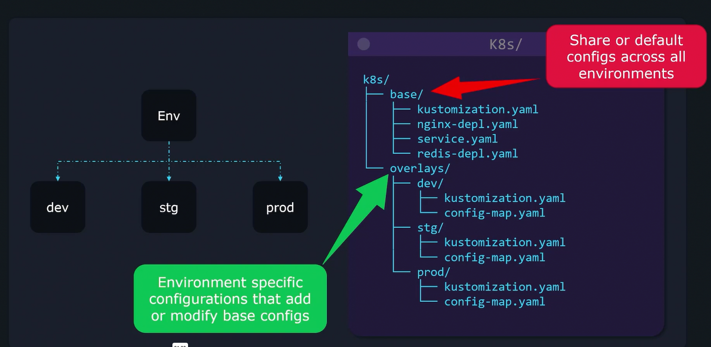
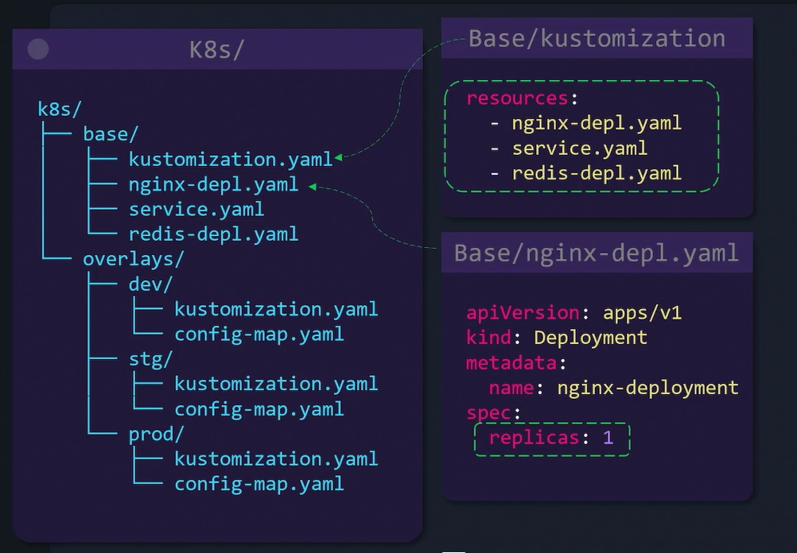
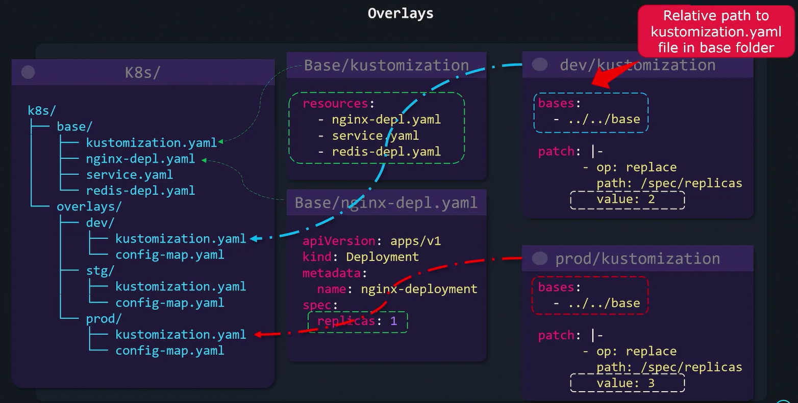
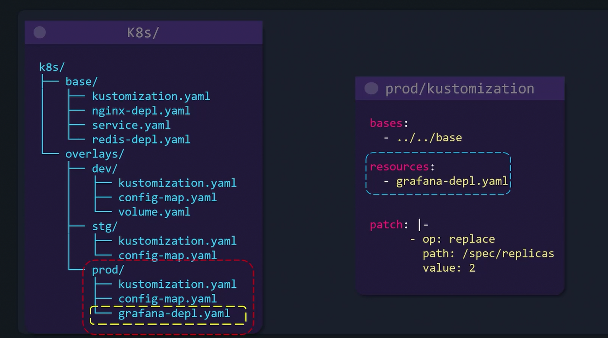

# Overlays

A typical Kustomize project is organized into two main sections:

1.  **Base Configuration** – Contains all shared configurations applicable across environments.
2.  **Overlays** – Contains environment-specific customizations that are applied as patches or additional resources.

## How Overlays Work

## ADD New Resources

