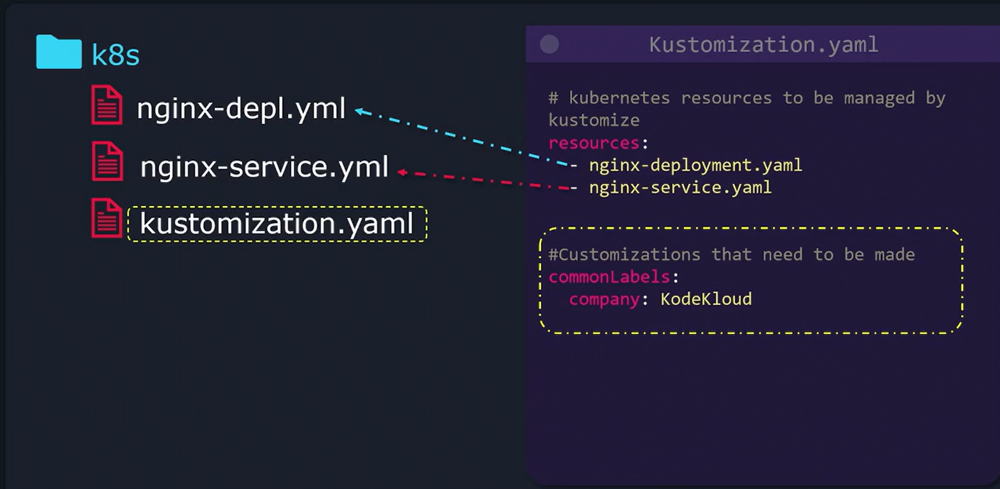
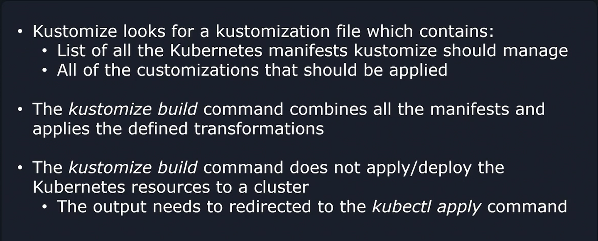

# Kustomization.yaml File
-   *Kustomize* streamlines the customization of Kubernetes resource files **without modifying the original YAML manifests.**

-   The *kustomization.yaml* file acts as the **entry point**, **directing Kustomize to your Kubernetes configurations and specifying the required customizations.**

## Structure of kustomization.yaml
The kustomization.yaml file has two main sections:
1.  **Kubernetes Resources:** A list of resource files that *Kustomize should manage.*

2.  **Customizations/Transformations:** Definitions for transformations to apply to these resources.

```bash
#kustomization.yaml 

# Kubernetes resources to be managed by Kustomize
resources:
  - nginx-deployment.yaml
  - nginx-service.yaml


# Customizations to be applied to all resources
commonLabels:
  company: KodeKloud
```

### Note:
-   **"resources"** section tells Kustomize **which YAML files to include**
-   While the **"commonLabels"** section adds a **consistent label** (key: company, value: KodeKloud) **to all the resources.**
-   Kustomize **supports various other complex transformations** beyond adding labels.




## Generating the Final Configuration
After creating your *kustomization.yaml*, you can generate the **final Kubernetes configuration by navigating to your "K8s" directory and running**:

### Command
```bash
kustomize build k8s/
```

### Output
```bash
apiVersion: v1
kind: Service
metadata:
  labels:
    company: KodeKloud
  name: nginx-loadbalancer-service
spec:
  ports:
    - port: 80
      protocol: TCP
      targetPort: 3000
  selector:
    company: KodeKloud
    component: nginx
  type: LoadBalancer
---
apiVersion: apps/v1
kind: Deployment
metadata:
  labels:
    company: KodeKloud
  name: nginx-deployment
spec:
  replicas: 1
  selector:
    matchLabels:
      company: KodeKloud
      component: nginx
  template:
    metadata:
      labels:
        company: KodeKloud
        component: nginx
    spec:
      containers:
        - image: nginx
          name: nginx
```
### Deployment Considerations
-   While Kustomize shows output on the terminal, **it does not deploy the resources directly.**

### Command  
```bash
kustomize build k8s/ | kubectl apply -f -
```

## Summary
