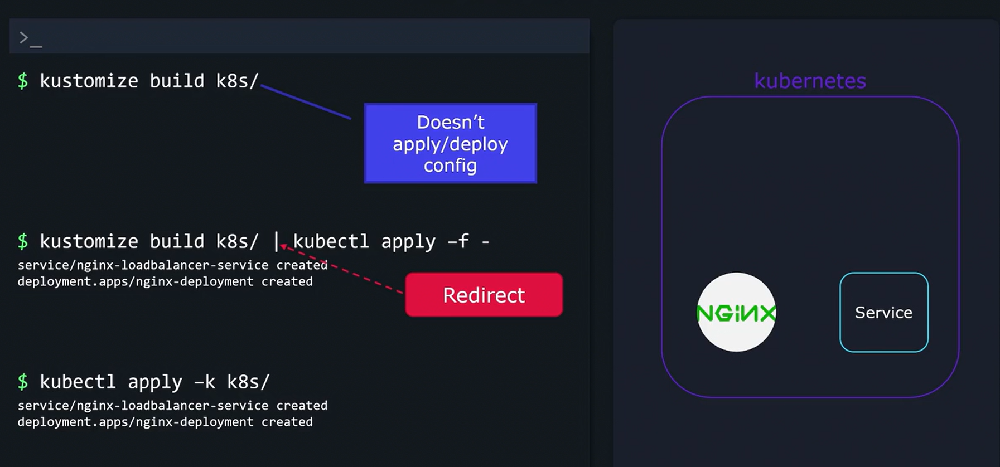
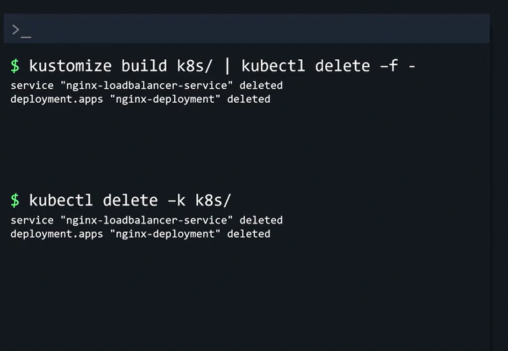

# Kustomize Output
Even though Kustomize outputs the final configuration, you must still deploy it to activate the resources on your cluster.

## Deplpoying Configurations
### 1. Deploying Configurations Using Pipes
```bash
kustomize build k8s/ | kubectl apply -f -
```

### 2. Deploying the Configuration with kubectl
```bash
kubectl apply -k k8s/
```



## Deleting Configurations

### 1. Using Pipe Method
```bash
kustomize build k8s/ | kubectl delete -f -
```

### 2. Using kubectl with -k Flag
```bash
kubectl delete -k k8s/
```
