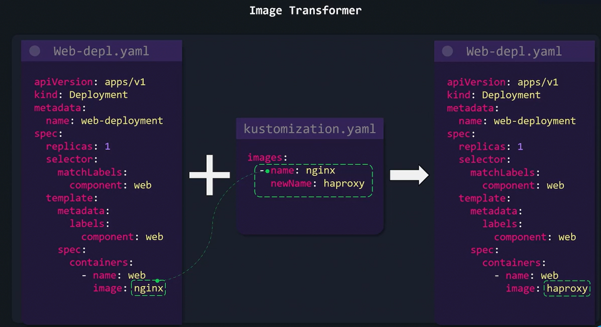
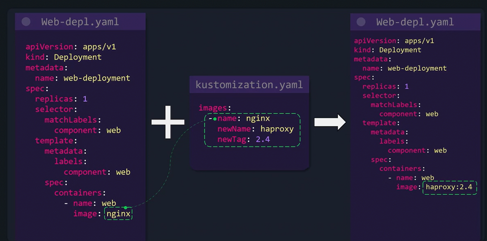

# Image Transformer
-   The image transformer feature enables you to **update an image's name or tag** across your deployment manifests *without manually editing each file.*

Below is an example deployment that initially uses the default NGINX image:

```bash
apiVersion: apps/v1
kind: Deployment
metadata:
  name: web-deployment
spec:
  replicas: 1
  selector:
    matchLabels:
      component: web
  template:
    metadata:
      labels:
        component: web
    spec:
      containers:
        - name: web
          image: nginx
```

## Change the Image

```bash
#Kustomization.yaml

images:
  - name: nginx
    newName: haproxy
```


## Change the Tag
```bash
#Kustomization.yaml

images:
  - name: nginx
    newTag: 2.4
```


## Combining Image Name and Tag Updates
```bash
#Kustomization.yaml

images:
  - name: nginx
    newName: haproxy
    newTag: 2.4
```


