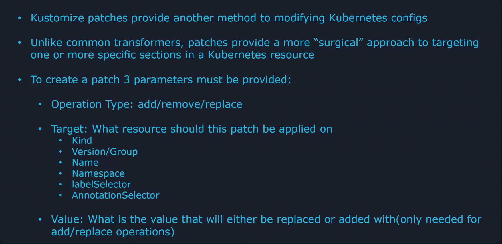
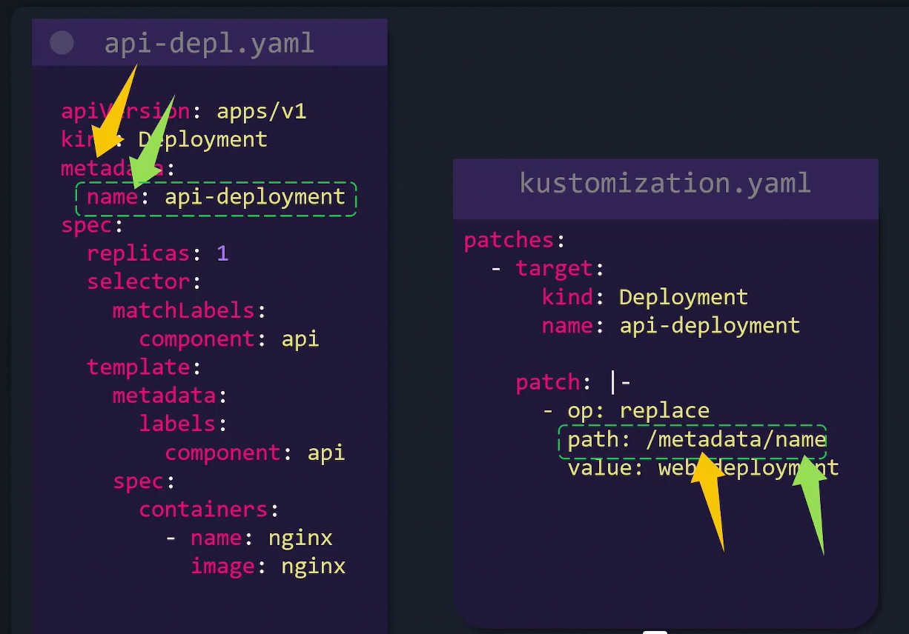
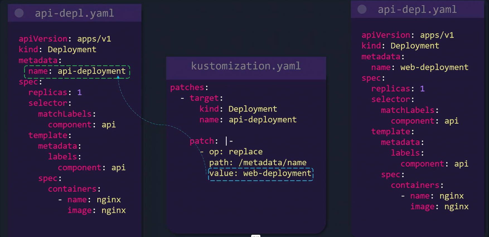
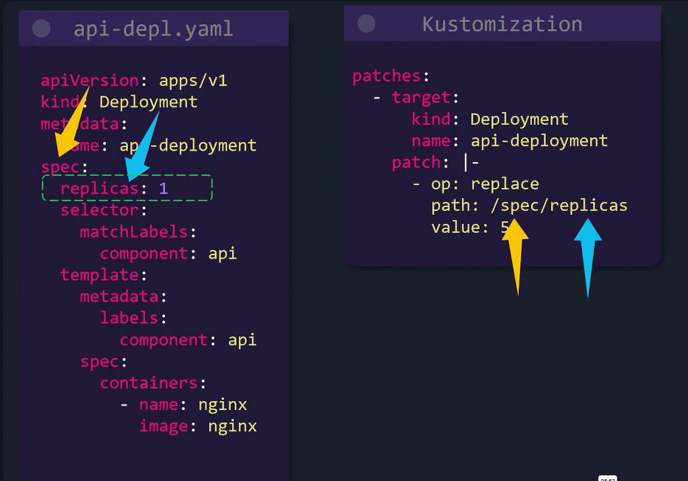
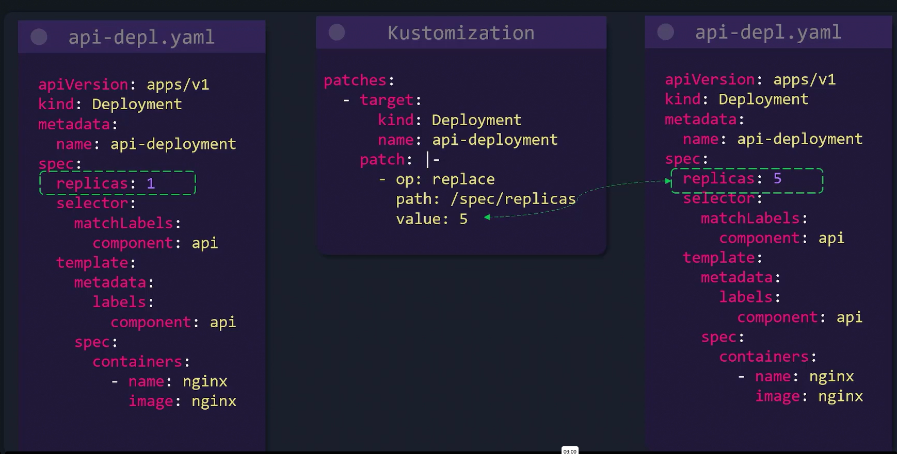
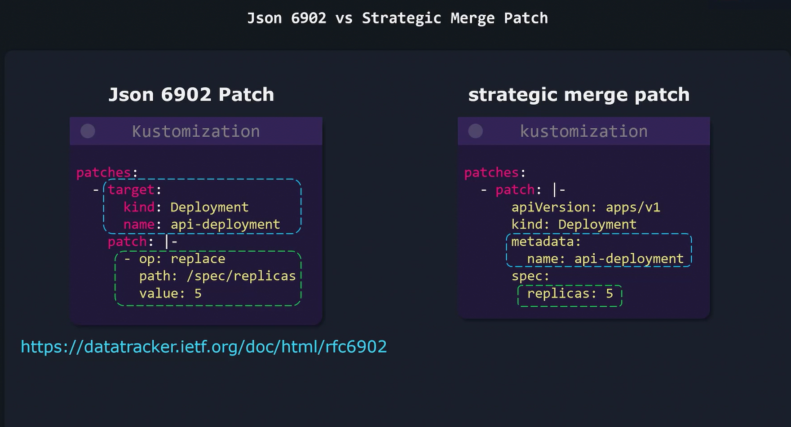

# Patches Intro
-   IT offers a **granular** approach to **updating specific sections of a Kubernetes resource**, which is especially useful when you want to target one or a few objects rather than applying a broad change.

-   For instance, if you need to update the **replica** count in a **Deployment,** a tailored patch that specifically addresses that object is ideal.


## Patch Parameters
When creating a patch, you **must specify three key parameters**:
1. **Operation Type:**
    -   The type of change to perfrom
        -   **add:** adds an elemt to a list [Adding a container to a Deployment's container list]
        -   **remove:** deletes an element for configuration [removing a container or label]
        -   **replace:** substitute an existing value with a new one [Updating a Deployment's replica count for 1 to 5]

2.  **Target:**
    -   Specifies **which K8 resource or resources will be patches**
    -   You can match resources based on properties such as **kind, version, name, namespace, label, selectors, or annotation selections**
    -   Multiple properties can be combined to precisely target the intended objects.
3.  **Value:**
    -   For **add** or **replace** operations, this parameter defines the value to be *added or used as a replacement.*
    -   The **remove** operation *does not require a value* since it deletes the specified element.




## Inline Patch Example [Example1]
We aim to change the *deployment* name from "**api-deployment" to "web-deployment"**.






```bash
apiVersion: apps/v1
kind: Deployment
metadata:
  name: api-deployment
spec:
  replicas: 1
  selector:
    matchLabels:
      component: api
  template:
    metadata:
      labels:
        component: api
    spec:
      containers:
      - name: nginx
        image: nginx
```
```bash
#kustomization.yaml

patches:
  - target:
      kind: Deployment
      name: api-deployment
    patch: |-
      - op: replace
        path: /metadata/name
        value: web-deployment
```

## Replacing the Replica Count [Example2]



```bash
apiVersion: apps/v1
kind: Deployment
metadata:
  name: api-deployment
spec:
  replicas: 1
  selector:
    matchLabels:
      component: api
  template:
    metadata:
      labels:
        component: api
    spec:
      containers:
      - name: nginx
        image: nginx
```

```bash
patches:
- target:
    kind: Deployment
    name: api-deployment
  patch: |-
    - op: replace
      path: /spec/replicas
      value: 5
```



## Patch Strategies: JSON 6902 vs. Strategic Merge Patch


