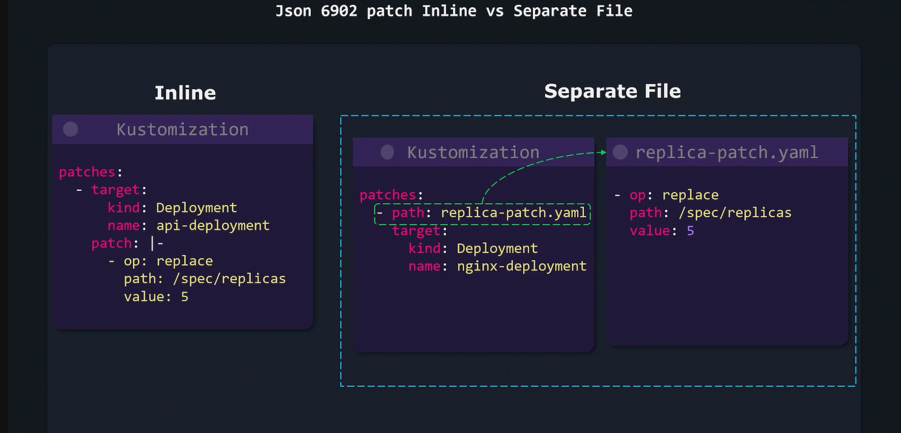
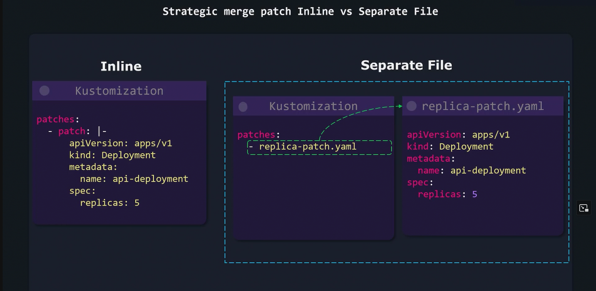

# Different Types of Patches

## Tip
For both patching methods, choose inline patches **[JSON or Strategic]** when dealing with a few simple modifications. 

For extensive configurations, using separate files can greatly enhance manageability and reduce complexity.