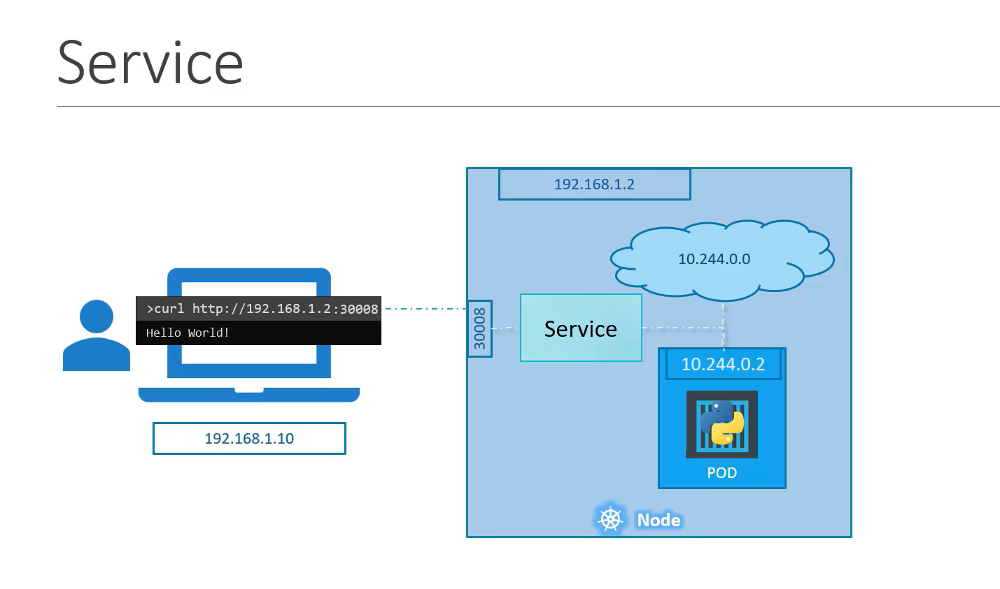
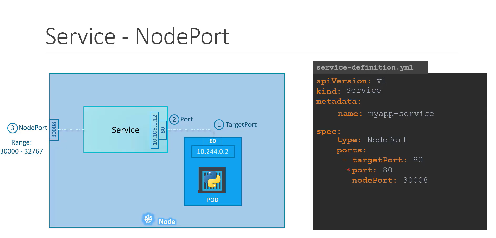
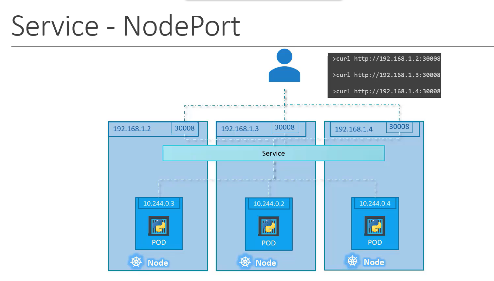
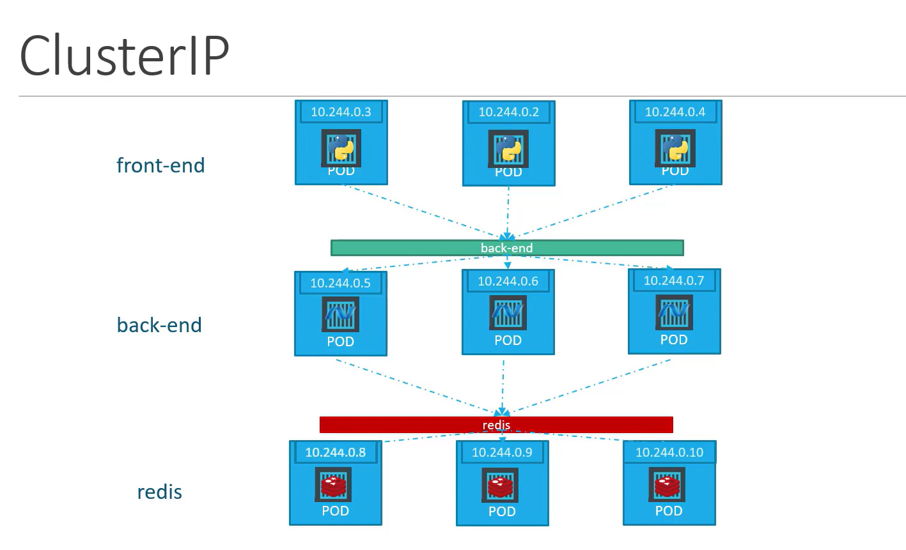
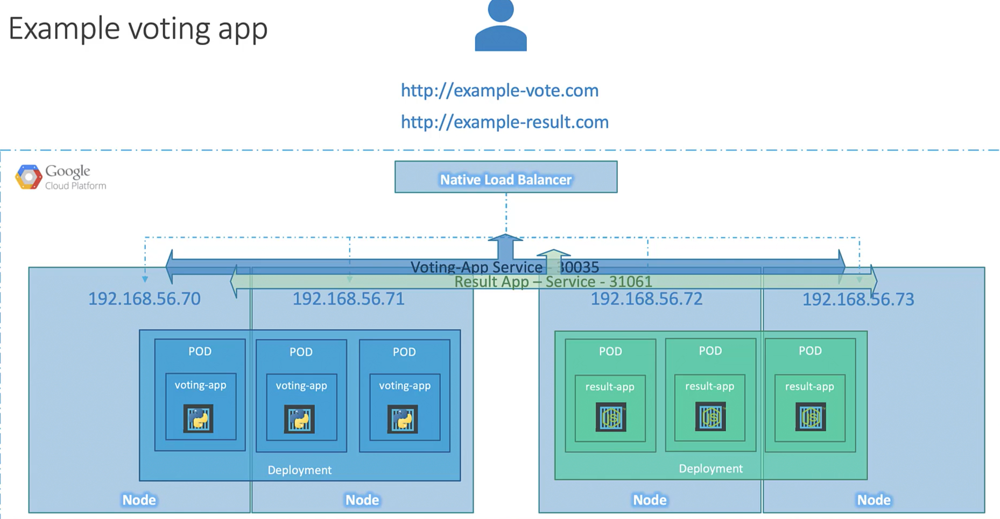

# Services




## Service Types

1. NodePort
    - External access to a single or multiple pods
2. ClusterIP
    - Service connectivity between frontend and backend pods  
3. LoadBalancer
    - Balancing traffic across multiple pods   

Describe Services
```bash
kubectl describe svc <service_name>
```
### NodePort





```bash
apiVersion : v1
kind: Service
metadata:
    name: myapp-service
spec:
    type: NodePort
    ports:
        - targetPort: 80        # Pod Port
          port: 80              # Service Port
          nodePort: 30008       # User Access Port
    selector:
            app: myapp
            type: front-end
```

Create a service
```bash
kubectl create -f service-definition.yml
```

List Services
```bash
kubectl get services
kubectl get svc
```

Acesss
```bash
curl http://192.168.1.2:30008
```




### Cluster IP
- Service connectivity between frontend and backend pods



```bash
apiVersion: v1
kind: Service
metadata:
    name: back-end
spec:
    type: ClusterIP
    ports:
        -   targetPort: 80      # Pod/Backend Port
            port: 80            # Service Port
    selector:
        app: myapp
        type: back-end
```

```bash
kubectl create -f service-definition.yml
```

### Load Balancer




```bash
apiVersion: v1
kind: Service
metadata:
    name: myapp-service
spec:
    type: LoadBalancer
    ports:
        - targetPort: 80
          port: 80
          nodePort: 30008

```