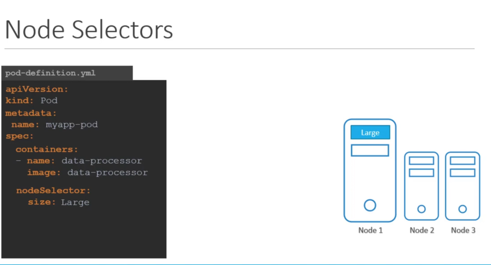
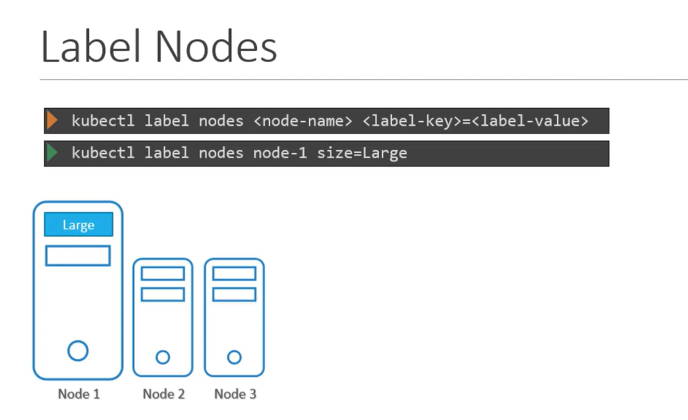

# Node Selector
-   Node selectors help align your pod deployments with the underlying hardware characteristics of your nodes, enhancing performance and resource management.

-   Node selectors restrict pod placement by matching key-value pairs defined in the pod’s specification against the labels on the nodes

## Configuring Node Selectors

```bash
apiVersion: v1
kind: Pod
metadata:
  name: myapp-pod
spec:
  containers:
    - name: data-processor
      image: data-processor
  nodeSelector:         # Node Selector
    size: Large

```



## Label Nodes
-   **Before deploying your pod, you must label your node so that it can be recognized by the selector.**

```bash
kubectl label nodes node-1 size=Large
```



-   Once the node is labeled, create the pod by applying your configuration:

```bash
kubectl create -f pod-definition.yaml
```