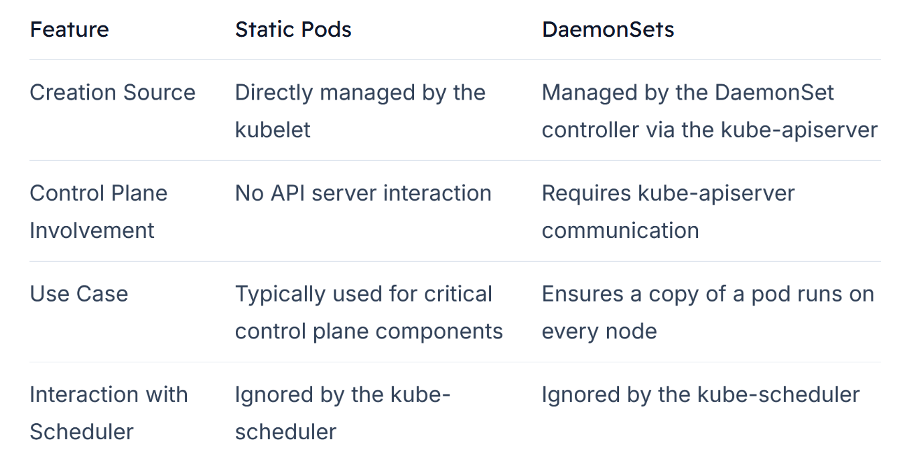

# Static Pods

-   Typically, the kubelet receives instructions from the kube-apiserver about which pods to run on its node

    -    These decisions, made by the kube-scheduler and stored in the etcd data store, are standard in a clustered environment.

-   But what happens when the kube-apiserver, kube-scheduler, and other control plane components are absent? **How does the node function on its own?**

-   When the kubelet and a container runtime (such as Docker) are installed directly on the host without a Kubernetes cluster, the kubelet can independently manage the node. 

    -   In this scenario, because there is no API server to provide pod details, you must supply the pod definition files directly to the kubelet.

*Static pods are created directly by the kubelet without the intervention of the API server or other control plane components.*


-   The kubelet is configured to monitor a designated directory on the host where pod definition files are stored. 

    -   The kubelet periodically scans this directory, reads available files, and creates the corresponding pods. It also monitors these pods and ensures they remain running. 
    
    -   For example, if an application crashes, the kubelet restarts it; if an updated file is detected, the kubelet recreates the pod to apply the changes; and if a file is removed, the corresponding pod is also deleted. These pods, created solely by the kubelet, are known as **static pods.**

-   It's important to note that only pod-level resources can be created this way. 

-   Higher-level abstractions such as **ReplicaSets, Deployments, or Services** depend on other control plane components (e.g., the replication and deployment controllers) and **cannot be managed via the static pod definition files.**


## Configuring the Static Pods Directory

-   You can place static pods in any directory on the host. 

-   The directory location is provided to the kubelet at startup by using the --pod-manifest-path option

```bash
ExecStart=/usr/local/bin/kubelet \
  --container-runtime=remote \
  --container-runtime-endpoint=unix:///var/run/containerd/containerd.sock \
  --pod-manifest-path=/etc/kubernetes/manifests \
  --kubeconfig=/var/lib/kubelet/kubeconfig \
  --network-plugin=cni \
  --register-node=true \
  --v=2
```


You can verify the status of static pods using container runtime commands. For instance, running the Docker command below on a host shows the containers spawned by static pods:

```bash
docker ps
CONTAINER ID        IMAGE                   COMMAND                  CREATED             STATUS              PORTS               NAMES
8e5d4c4db7b6        busybox                 "sh -c 'echo Hello K…'"  20 seconds ago      Up 20 seconds       k8s_myapp-container_myapp-pod-host01_default_48e37fb432f2e06350e76786bd0bac66_0
f6737e1149cb        k8s.gcr.io/pause:3.1     "/pause"                 24 seconds ago      Up 23 seconds       k8s_POD_myapp-pod-host01_default_48e37fb432f2e06350e76786bd0bac66_0
```
In a standalone scenario, ```use docker ps``` because the kube-apiserver is not available to process Kubernetes API requests.


## Behavior When Part of a Cluster

-   Whenever the kubelet creates a static pod in this configuration, it also creates a mirror object in the kube-apiserver. 

-   This mirror object is **read-only** and can be viewed with ```kubectl get pods```, but you cannot **modify or delete it through the API**. 

-   To update a static pod, modify the file in the node’s manifest directory.


## Static Pods vs. DaemonSets




-   Static pods are especially useful for deploying control plane components themselves. 

-   Once the kubelet is installed on all master nodes, you can create pod definition files for essential components like the API server and controller manager. 

-   By placing these files in the designated manifest folder, the kubelet ensures they are running as pods and restarts them automatically if they fail. 

-   When you check the pods in the kube-system namespace, you'll see these control plane components running as pods—a standard configuration in clusters set up using kubeadm.