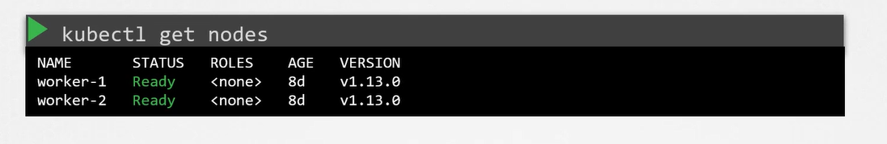
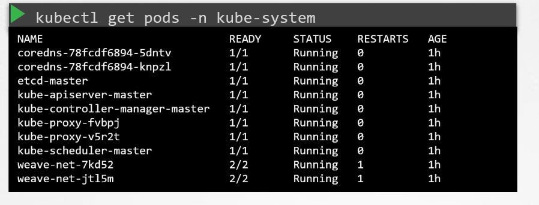
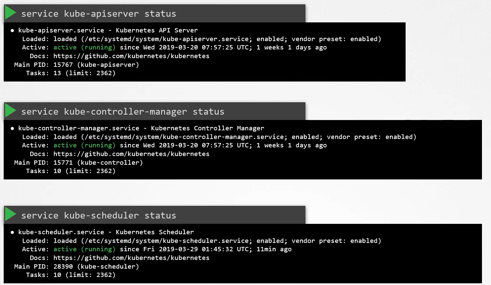
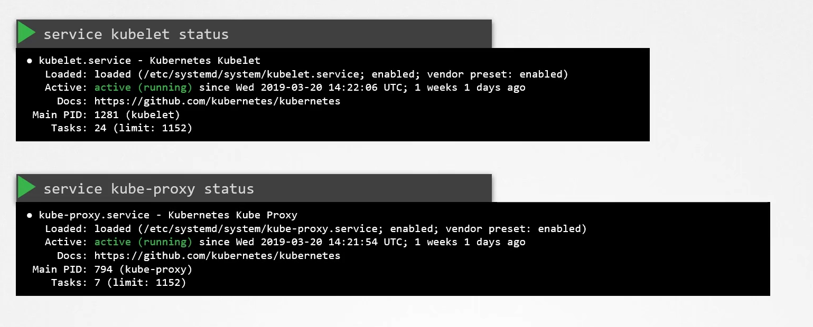
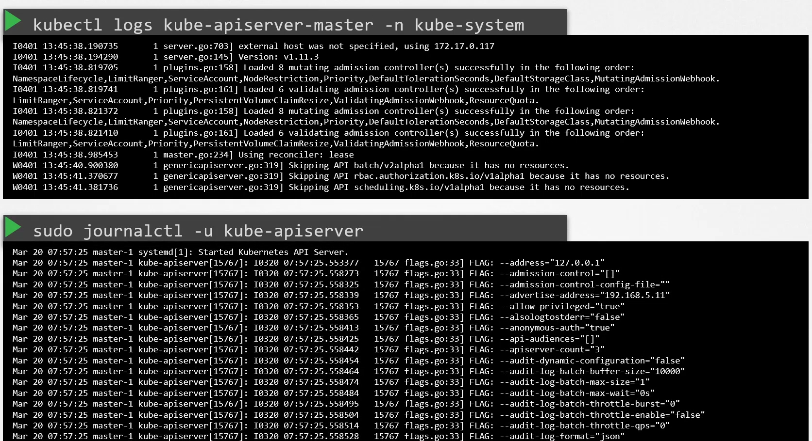

# Control Plane Failure

## 1. Verify Cluster Node Health

```bash
kubectl get nodes
```

### a. Confirm Control Plane Component Status


```bash
kubectl get pods
```

### b. Check Controlplane Pods


```bash
kubectl -n kube-system get pods
```

## 2. Confirm Control Plane Component Status




### a. Checking the Kubernetes API Server

```bash
service kube-apiserver status
```
### b. Checking the Controller Manager

```bash
service kube-controller-manager status
```
### c. Checking the Scheduler

```bash
service kube-scheduler status
```

## 3. Review Control Plane Logs


### a. Retrieving Pod Logs (When Using kubeadm)
```bash
kubectl logs kube-apiserver-master -n kube-system
```

### b. Using the Journal for Native Service Logs

```bash
sudo journalctl -u kube-apiserver
```

