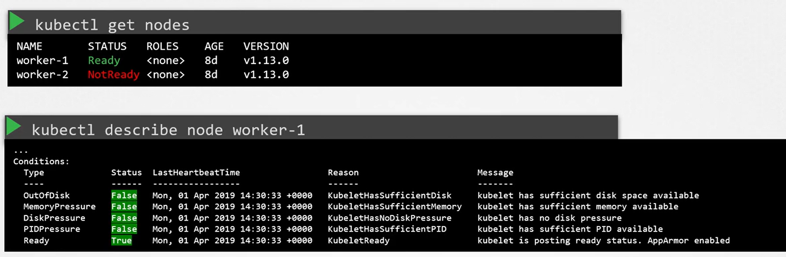
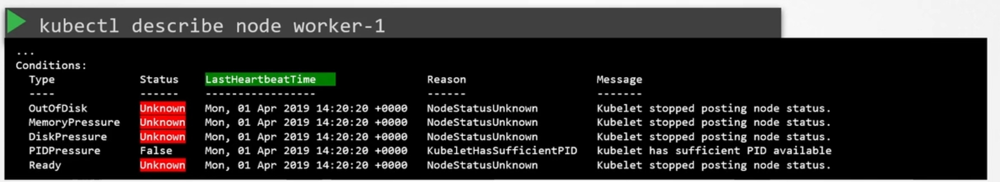
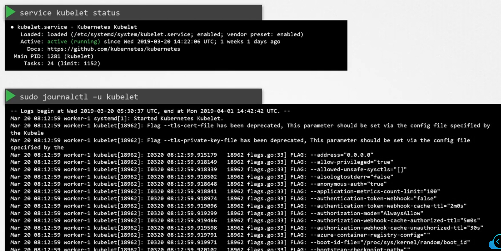
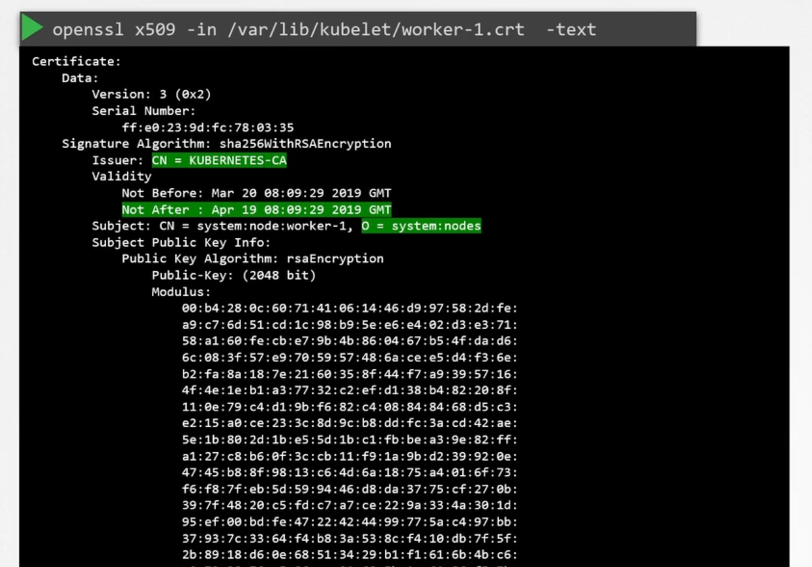

# Worker Node Failure

## 1. Check Node Status
```bash
kubectl get nodes
```

If node is not ready

```bash
kubectl describe node worker-1
```

-   This command produces an output with various conditions, such as 

    1.  OutOfDisk, 
    2.  MemoryPressure, 
    3.  DiskPressure, 
    4.  PIDPressure, and 
    5.  Ready. 

-   Each condition will have a status of true or false that helps pinpoint issues. 

    -   For example, if disk space is insufficient, the OutOfDisk flag will be set to true; if there is low memory, the MemoryPressure flag will reflect that





### Check
1. CPU (```top```)
2. Storage (```df -h```)
3. Memory (```free -h```)
###  Tip

Always review the **"LastHeartbeatTime"** field. It indicates when a node last communicated with the master, which can provide insights if a node has unexpectedly gone down.

##  2. Validate Node Operation and Kubelet Health

Check the Kubelet Service Status
```bash
service kubelet status
```


Inspect Kubelet Logs
```bash
sudo journalctl -u kubelet
```


## 3. Verify Kubelet Certificates


```bash
openssl x509 -in /var/lib/kubelet/worker-1.crt -text
```

### Attention

Be sure that the certificate is issued by the correct CA and that none of the certificate parameters (e.g., validity period) indicate an impending or current issue.