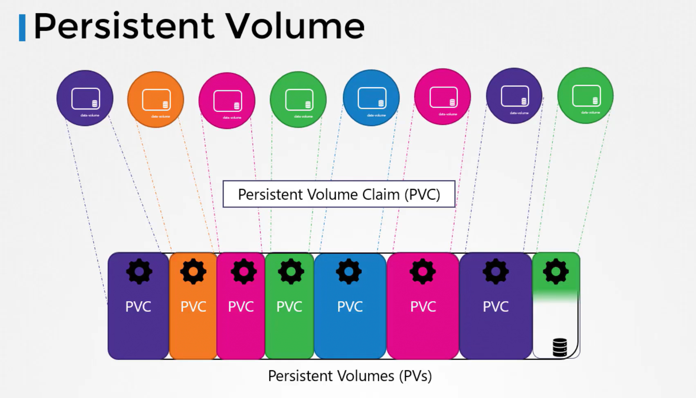

# Persistent Volumes
-   Previously, we discussed how **volumes** are **defined within pod manifest files**, where the storage settings are directly included in each pod definition.

-   In environments **where many users deploy multiple pods,** *duplicating storage configuration* in every pod file can lead to **redundancy and increased maintenance efforts.**
    - Any required change would need to be propagated across all pod definitions.   

-   *To solve this issue,* **administrators can create a centralized pool of storage.**

    -   Users then request portions of this storage as needed by creating persistent volume claims (PVCs). 
    -   This concept is enabled by persistent volumes (PVs).   

-   A **persistent volume** is a *cluster-wide storage resource* defined and managed by an administrator. 

-   Applications running on the cluster utilize these PVs by **binding to them via persistent volume claims**.



## Creating a Persistent Volume

```bash
apiVersion: v1
kind: PersistentVolume
metadata:
  name: pv-vol1
spec:
  accessModes:
    - ReadWriteOnce
  capacity:
    storage: 1Gi
  hostPath:
    path: /tmp/data
```

Under the ```spec``` section, it's necessary to define the **access modes**.

1.  **ReadWriteOnce**: The volume can be mounted as *read-write by a single node*.
    
2.  **ReadOnlyMany:** The volume can be mounted as *read-only by multiple nodes*.
    
3.  **ReadWriteMany**: The volume can be mounted as *read-write by multiple nodes*.

### Note
The ```hostPath``` option is primarily for **testing** or **single-node setups** and is not **recommended for production environments.**

```bash
kubectl create -f pv-d
```

Verify/ List PV
```bash
kubectl get persistentvolume
```

PV in POD
```bash
apiVersion: v1
kind: Pod
metadata:
  creationTimestamp: null
  labels:
    run: webapp
  name: webapp
spec:
  containers:
  - image: kodekloud/event-simulator
    name: webapp
    resources: {}
    volumeMounts:
      - mountPath: "/log"
        name: log-volume
  volumes:
    - name: log-volume
      hostPath:
        path: /var/log/webapp
        type: Directory
  dnsPolicy: ClusterFirst
  restartPolicy: Always
status: {}
```