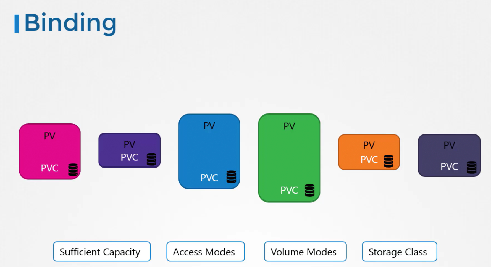

# Persistent Volume Claim

-   We will explore how to **create a Persistent Volume Claim**(PVC) to **expose that storage to a node**.

-   **Persistent volumes** and **persistent volume claims** are **two distinct objects** in Kubernetes.

-   An **administrator** is *responsible* for **creating PVs**, while **users** create **PVCs** to *request storage resources.*

-   When a PVC is created, Kubernetes automatically **binds it to a PV** that meets the requested **capacity, access modes, volume modes, and storage class**.


-   Kubernetes evaluates several factors when binding a PVC to a PV. 

    -   **If multiple PVs can satisfy** a claim, you can use **labels** and **selectors** to bind the claim to a specific volume.




## Important
-   If a** smaller PVC** is matched with a **larger PV** that meets all criteria, the **unrequested capacity remains unused by any other PVC.**


## Creating a Persistent Volume Claim


```bash
#pvc-definition.yaml
apiVersion: v1
kind: PersistentVolumeClaim
metadata:
  name: myclaim
spec:
  accessModes:
    - ReadWriteOnce
  resources:
    requests:
      storage: 500Mi
```

```bash
kubectl create -f pvc-definition.yaml
```

```bash
kubectl get persistentvolumeclaim
```

## Deleting a PVC 
```bash
kubectl delete persistentvolumeclaim myclaim
```


## Persistent Volume Reclaim Policies

-   When a PVC is deleted, what happens next depends on the underlying persistent volume's reclaim policy. 


Example
```bash
persistentVolumeReclaimPolicy: Retain
```
```bash
apiVersion: v1
kind: PersistentVolume
metadata:
  name: pv-log
spec:
  persistentVolumeReclaimPolicy: Retain
  accessModes:
    - ReadWriteMany
  capacity:
    storage: 100Mi
  hostPath:
    path: /pv/log
```

## PVC in a pod

```bash
apiVersion: v1
kind: Pod
metadata:
 name: mypod
spec:
 containers:
  - name: myfrontend
   image: nginx
   volumeMounts:
   - mountPath: "/var/www/html"
    name: mypd
 volumes:
  - name: mypd
   persistentVolumeClaim:
    claimName: myclaim
```

The same is true for ReplicaSets or Deployments. 
-   Add this to the pod template section of a Deployment on ReplicaSet.